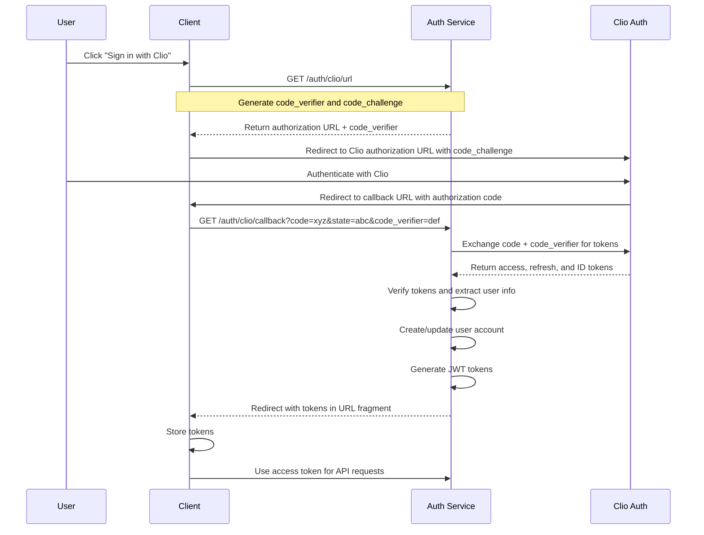
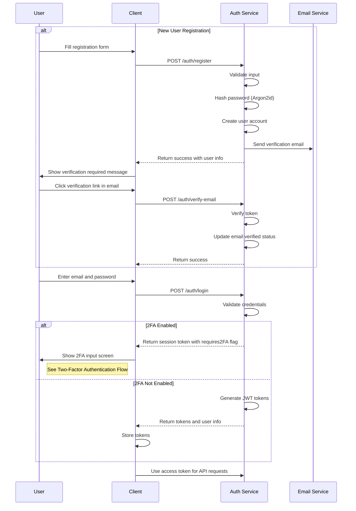
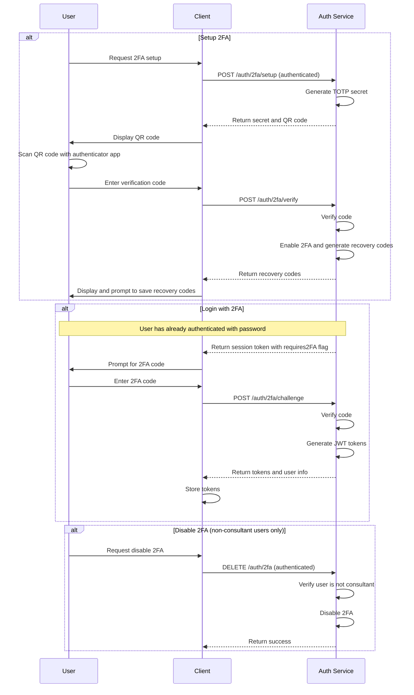
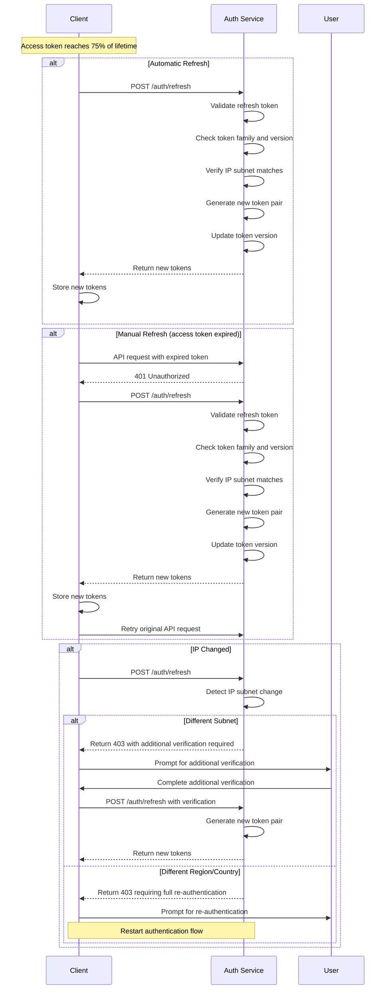
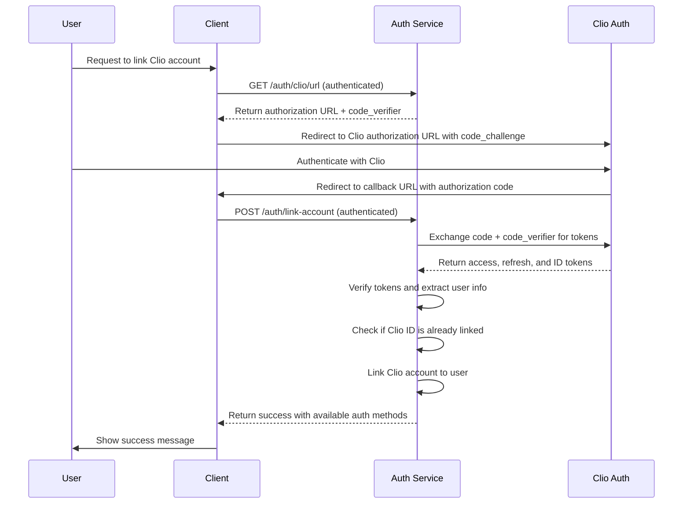
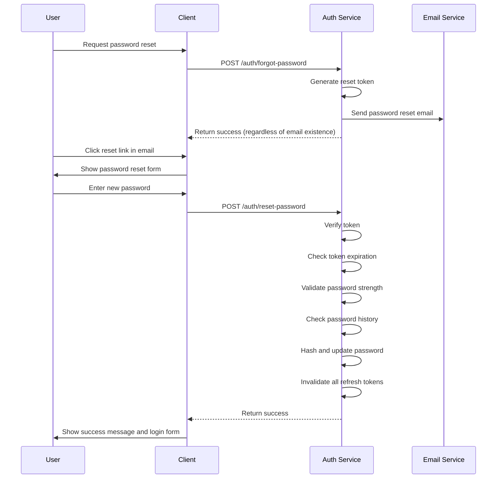

# Authentication Flows

This document describes the authentication flows for the Smarter Firms platform, including sequence diagrams for each flow.

## Table of Contents

1. [Clio SSO Authentication Flow](#clio-sso-authentication-flow)
2. [Email/Password Authentication Flow](#emailpassword-authentication-flow)
3. [Two-Factor Authentication Flow](#two-factor-authentication-flow)
4. [Token Refresh Flow](#token-refresh-flow)
5. [Account Linking Flow](#account-linking-flow)
6. [Password Reset Flow](#password-reset-flow)

## Clio SSO Authentication Flow

This flow implements OAuth 2.0 with PKCE for secure authentication with Clio.

### Key Security Measures:
- PKCE (Proof Key for Code Exchange) to prevent authorization code interception
- State parameter to prevent CSRF attacks
- Code challenge method: S256 only (plain not supported)
- JWT tokens with RS256 signing for secure API access

## Email/Password Authentication Flow

Traditional email/password authentication with optional two-factor authentication.

### Key Security Measures:
- Argon2id password hashing with proper parameters
- Rate limiting on login attempts
- Email verification required
- Strong password requirements enforced
- Account lockout after multiple failed attempts

## Two-Factor Authentication Flow

Additional security layer after successful password authentication.

### Key Security Measures:
- TOTP (Time-based One-Time Password) using industry standard algorithm
- Recovery codes for backup access
- Mandatory 2FA for consultant accounts
- Rate limiting on verification attempts

## Token Refresh Flow

Process for obtaining new tokens without requiring re-authentication.

### Key Security Measures:
- Token family tracking to detect token theft
- Token versioning to invalidate older tokens
- IP subnet binding with tiered security approach
- Rate limiting on refresh requests
- JTI (JWT ID) tracking for token uniqueness

## Account Linking Flow

Process for linking an external authentication provider to an existing account.

### Key Security Measures:
- Authentication required for account linking
- PKCE flow for secure OAuth
- Prevention of linking same Clio account to multiple users
- Proper error handling for conflict scenarios

## Password Reset Flow

Secure flow for resetting a forgotten password.

### Key Security Measures:
- Time-limited reset tokens (1 hour validity)
- Same response whether email exists or not (prevents enumeration)
- Strong password requirements enforced
- Password history checking to prevent reuse
- All existing sessions invalidated after reset
- Rate limiting on forgot password requests 