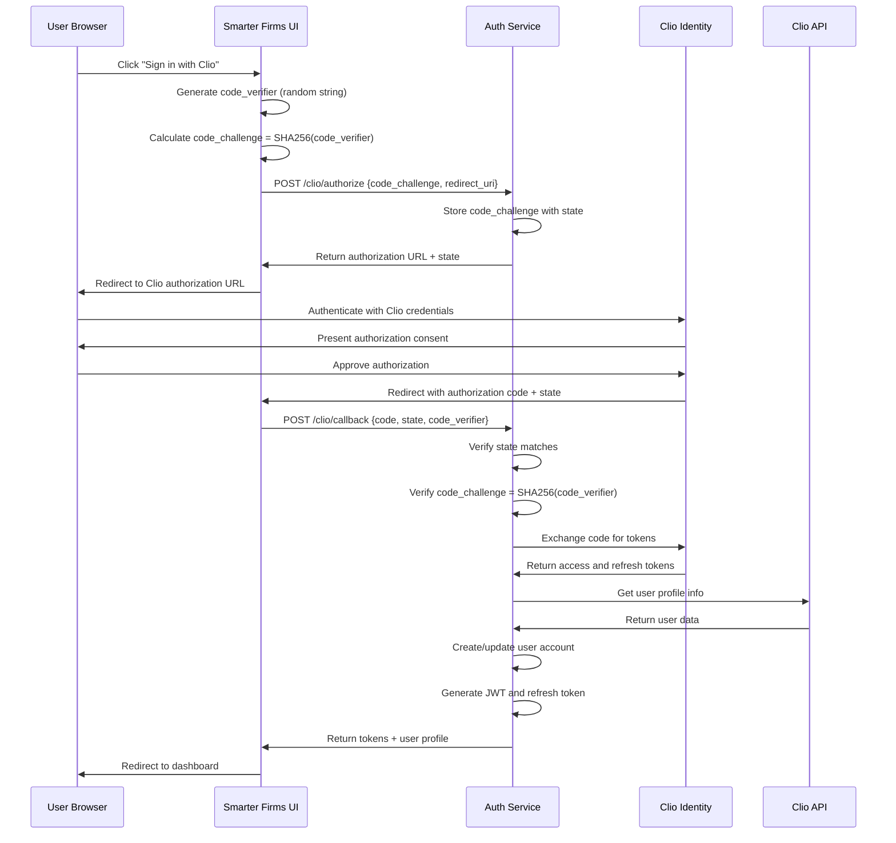
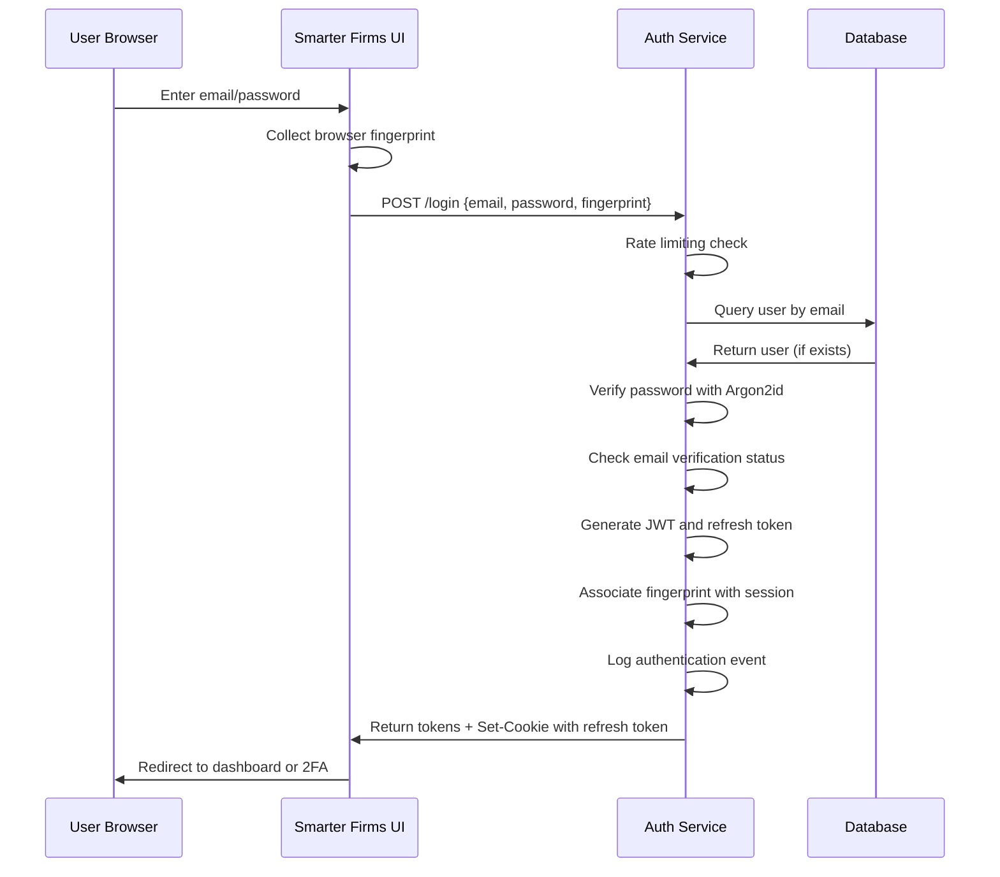
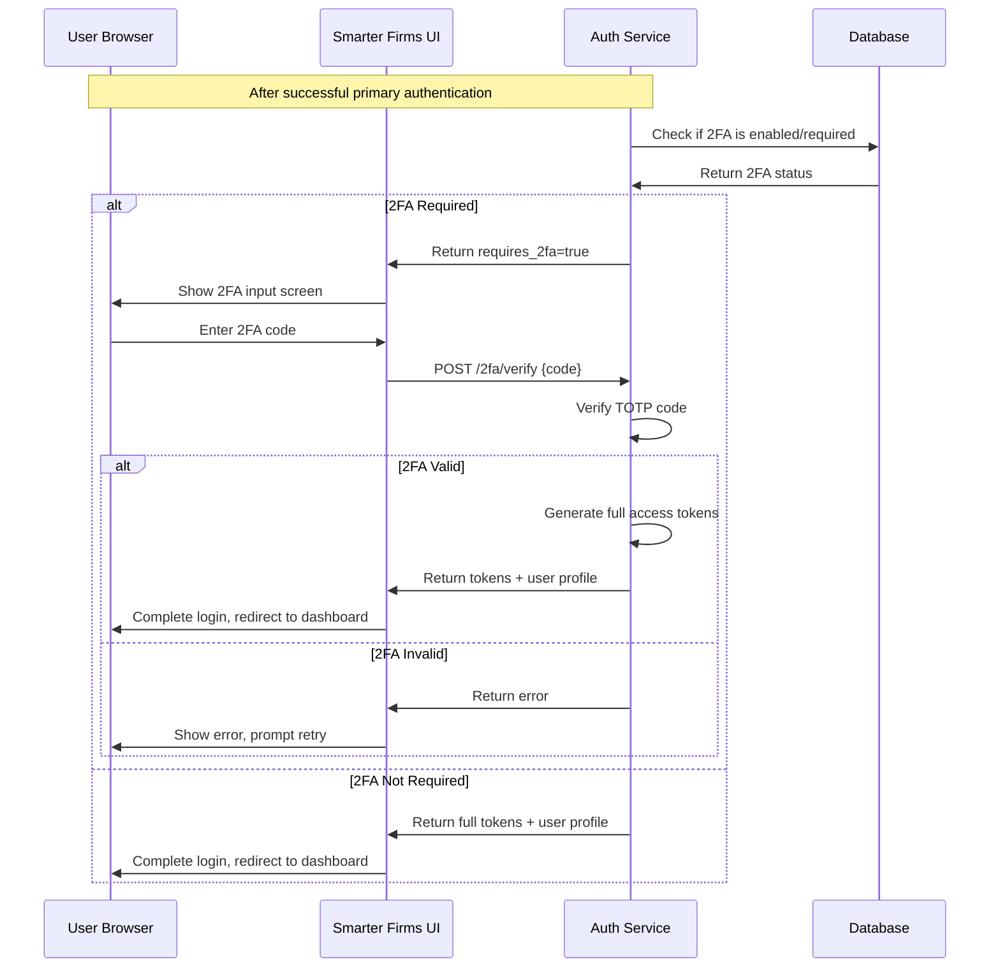
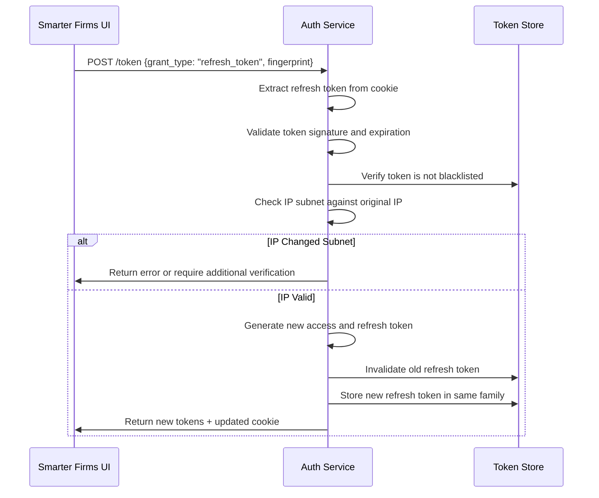
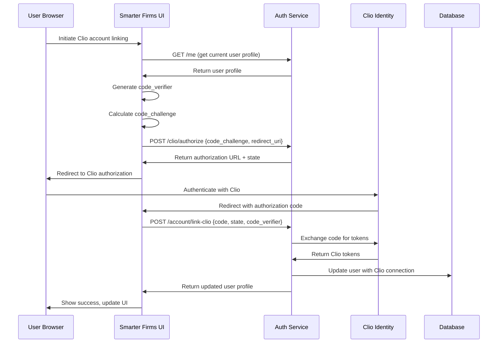
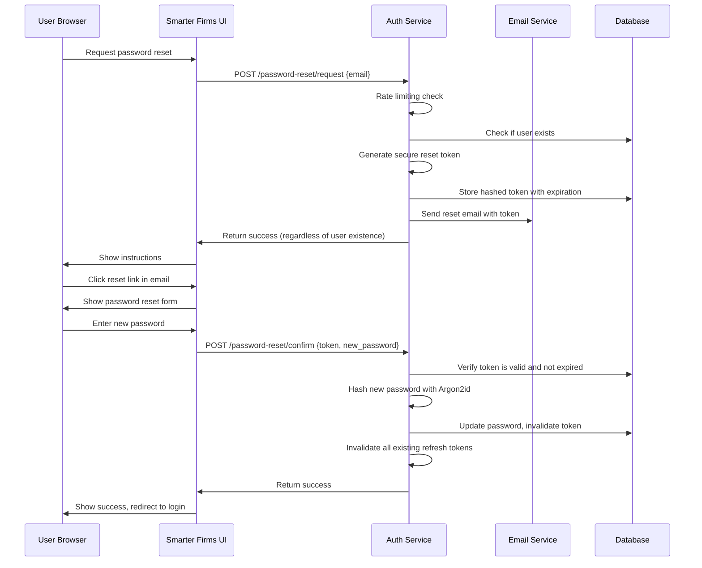

# Authentication Flows

This document details the authentication flows implemented in the Smarter Firms platform.

## Clio SSO Flow with PKCE

The primary authentication method for law firm users is Single Sign-On (SSO) with Clio, implemented using the OAuth 2.0 Authorization Code flow with PKCE (Proof Key for Code Exchange) for enhanced security.

### Security Measures

- PKCE implementation requires S256 method only (no plain code challenge)
- Code verifier: 43-128 characters, cryptographically secure random generation
- State parameter for CSRF protection
- HTTP-only cookies for refresh tokens
- Multiple redirect URI validation

## Email/Password Authentication

Traditional email/password authentication serves as a fallback method and for consultant users.

### Security Measures

- Argon2id password hashing with proper parameters
- Rate limiting by IP and username
- Browser fingerprinting for suspicious login detection
- Account lockout after multiple failures
- Comprehensive security event logging

## Two-Factor Authentication Flow

Mandatory for consultant accounts, optional for law firm users.

## Token Refresh Strategy

Includes IP-binding and token family tracking for enhanced security.

### Security Measures

- Token family tracking to detect theft
- IP subnet binding with tiered verification
- Automated blacklisting of suspicious token families
- Refresh token rotation on every use

## Account Linking Process

For connecting existing accounts to Clio.

## Password Reset Flow

Secure flow for password recovery.

## Error Handling

All authentication flows include standardized error handling:

- Specific error codes for different failure scenarios
- Rate limiting information in headers
- Graceful degradation when subsystems are unavailable
- Security-focused logging that avoids sensitive data 