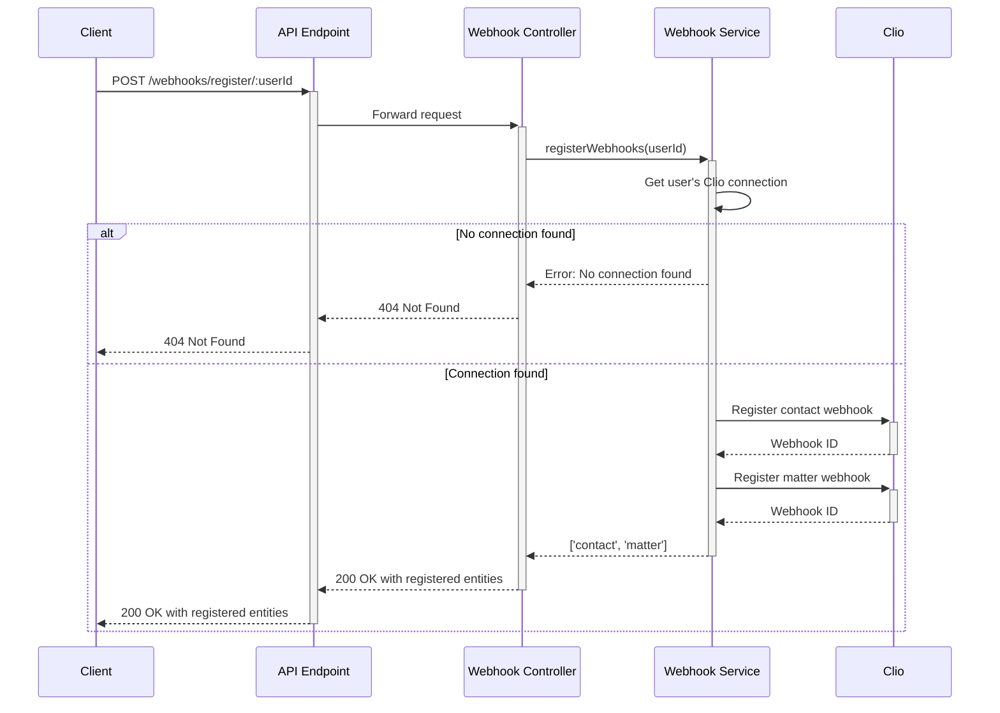

# Webhook Flow Diagram

The following diagram illustrates the webhook flow from Clio to our system.

```mermaid
sequenceDiagram
    participant Clio
    participant Webhook as Webhook Endpoint
    participant Controller as Webhook Controller
    participant Service as Webhook Service
    participant Repository as Data Repositories
    participant Database as PostgreSQL Database
    
    Note over Clio: Data changes in Clio
    
    Clio->>+Webhook: POST /webhooks/clio with payload & signature
    Webhook->>Webhook: Apply raw body middleware
    Webhook->>+Controller: Forward request
    
    Controller->>+Service: validateSignature(signature, body)
    
    alt Invalid Signature
        Service-->>-Controller: false
        Controller-->>-Webhook: 401 Unauthorized
        Webhook-->>Clio: 401 Unauthorized
    else Valid Signature
        Service-->>-Controller: true
        
        Controller->>+Service: processWebhook(payload)
        
        alt Contact Event
            Service->>Service: handleContactEvent(id, userId)
            Service->>Clio: GET contact data
            Clio-->>Service: Contact data
            Service->>Service: Transform to internal model
            Service->>+Repository: upsertContact(contact)
            Repository->>Database: Insert/Update contact
            Database-->>Repository: Success
            Repository-->>-Service: Saved contact
        else Matter Event
            Service->>Service: handleMatterEvent(id, userId)
            Service->>Clio: GET matter data
            Clio-->>Service: Matter data
            Service->>Service: Transform to internal model
            Service->>+Repository: upsertMatter(matter)
            Repository->>Database: Insert/Update matter
            Database-->>Repository: Success
            Repository-->>-Service: Saved matter
        end
        
        Service-->>-Controller: Success
        Controller-->>-Webhook: 200 OK
        Webhook-->>Clio: 200 OK
    end
```

## Webhook Registration Flow

The following diagram illustrates the webhook registration process.



These diagrams illustrate how webhooks are received, validated, and processed within our system, as well as how they are registered with Clio for each user. 