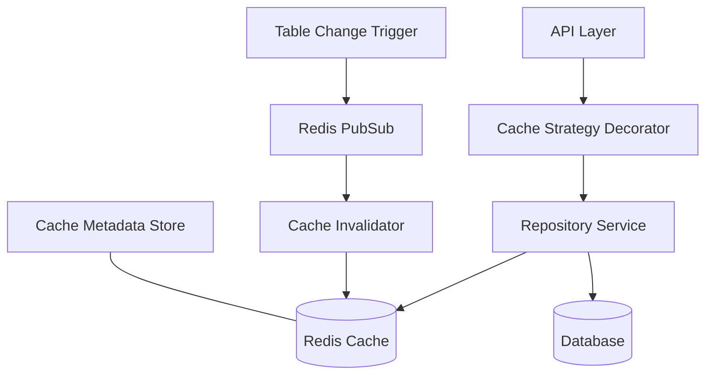

# Cache Invalidation Strategy

This document outlines the tenant-aware cache invalidation strategy implemented in the Data Service for the Smarter Firms platform.

## Overview

The multi-tenant nature of the Smarter Firms platform introduces unique caching challenges. Our caching strategy ensures:

1. Complete tenant data isolation in cached data
2. Efficient and targeted cache invalidation
3. Support for consultant cross-tenant data access
4. Resilience against race conditions and stale data

## Caching Architecture



## Core Components

### 1. Tenant-Aware Cache Keys

All cache keys include a tenant prefix to ensure complete tenant isolation:

```typescript
// Function to generate tenant-specific cache key
export function generateCacheKey(
  tenantId: string,
  entity: string,
  id?: string,
  params?: Record<string, any>
): string {
  // Base key with tenant ID and entity
  let key = `tenant:${tenantId}:${entity}`;
  
  // Add ID if provided
  if (id) {
    key += `:${id}`;
  }
  
  // Add query parameters if provided
  if (params) {
    // Sort parameters for consistent keys
    const sortedParams = Object.keys(params).sort().reduce(
      (result, key) => {
        result[key] = params[key];
        return result;
      },
      {} as Record<string, any>
    );
    
    // Append stringified parameters
    key += `:${JSON.stringify(sortedParams)}`;
  }
  
  // Hash key if it's too long
  if (key.length > 200) {
    // Create hash of the key
    const hash = createHash('sha256').update(key).digest('hex');
    key = `tenant:${tenantId}:${entity}:hash:${hash}`;
    
    // Store the original key mapping for debugging
    storeKeyMapping(hash, key);
  }
  
  return key;
}
```

### 2. Cache Decorator for Repository Methods

A decorator automatically handles caching for repository methods:

```typescript
// Cache decorator for repository methods
export function Cacheable(options: {
  entity: string;
  ttl?: number;
  idParam?: string;
  invalidateOn?: string[];
}) {
  return function(
    target: any,
    propertyKey: string,
    descriptor: PropertyDescriptor
  ) {
    const originalMethod = descriptor.value;
    
    descriptor.value = async function(...args: any[]) {
      const tenantContext = this.tenantContext as TenantContextService;
      const cacheService = this.cacheService as CacheService;
      
      // Get current tenant ID
      const tenantId = tenantContext.getCurrentTenant();
      if (!tenantId) {
        // No tenant context, skip caching
        return originalMethod.apply(this, args);
      }
      
      // Extract ID parameter if specified
      let id: string | undefined;
      if (options.idParam) {
        const idIndex = options.idParam === 'first' ? 0 : Number(options.idParam);
        id = args[idIndex];
      }
      
      // Extract other parameters
      const params = args.reduce((acc, arg, index) => {
        if (typeof arg === 'object' && arg !== null) {
          acc[`p${index}`] = arg;
        }
        return acc;
      }, {} as Record<string, any>);
      
      // Generate cache key
      const cacheKey = generateCacheKey(tenantId, options.entity, id, params);
      
      try {
        // Try to get from cache
        const cachedResult = await cacheService.get(cacheKey);
        if (cachedResult) {
          // Cache hit
          return JSON.parse(cachedResult);
        }
      } catch (error) {
        // Log cache error but continue with method execution
        console.error('Cache read error', error);
      }
      
      // Cache miss, execute original method
      const result = await originalMethod.apply(this, args);
      
      try {
        // Cache the result
        await cacheService.set(
          cacheKey,
          JSON.stringify(result),
          options.ttl || 3600 // Default 1 hour TTL
        );
        
        // Register cache entry for invalidation
        if (options.invalidateOn) {
          await this.cacheService.registerInvalidation(
            tenantId,
            options.entity,
            id,
            options.invalidateOn
          );
        }
      } catch (error) {
        // Log cache error but return the result anyway
        console.error('Cache write error', error);
      }
      
      return result;
    };
    
    return descriptor;
  };
}
```

### 3. Automatic Cache Invalidation

Cache invalidation is triggered by database changes:

```typescript
// Cache invalidation service
@Injectable()
export class CacheInvalidationService {
  constructor(
    private readonly redisService: RedisService,
    private readonly cacheService: CacheService
  ) {
    this.setupInvalidationSubscriber();
  }
  
  // Set up Redis PubSub subscriber for invalidation events
  private setupInvalidationSubscriber() {
    // Subscribe to cache invalidation channel
    this.redisService.subscribe('cache:invalidate', async (message: string) => {
      try {
        const invalidation = JSON.parse(message);
        await this.invalidate(
          invalidation.tenantId,
          invalidation.entity,
          invalidation.id,
          invalidation.action
        );
      } catch (error) {
        console.error('Error processing invalidation', error);
      }
    });
  }
  
  // Invalidate cache entries based on entity changes
  async invalidate(
    tenantId: string,
    entity: string,
    id?: string,
    action: 'create' | 'update' | 'delete' = 'update'
  ): Promise<void> {
    // Get keys to invalidate
    const keysToInvalidate = await this.getKeysToInvalidate(tenantId, entity, id, action);
    
    // Invalidate all affected keys
    if (keysToInvalidate.length > 0) {
      await this.cacheService.del(...keysToInvalidate);
      console.log(`Invalidated ${keysToInvalidate.length} cache entries`);
    }
  }
  
  // Get keys that should be invalidated
  private async getKeysToInvalidate(
    tenantId: string,
    entity: string,
    id?: string,
    action: 'create' | 'update' | 'delete' = 'update'
  ): Promise<string[]> {
    const keysToInvalidate: string[] = [];
    
    // Key pattern for entity list queries
    const listPattern = `tenant:${tenantId}:${entity}:*`;
    
    // Always invalidate list queries on any change
    const listKeys = await this.redisService.keys(listPattern);
    keysToInvalidate.push(...listKeys);
    
    // For specific entity updates or deletes, invalidate that entity
    if (id && (action === 'update' || action === 'delete')) {
      const entityKey = `tenant:${tenantId}:${entity}:${id}`;
      keysToInvalidate.push(entityKey);
    }
    
    // Get related entities that should be invalidated
    const relatedEntities = await this.cacheService.getInvalidationRules(
      tenantId,
      entity,
      id
    );
    
    // Invalidate related entity keys
    for (const related of relatedEntities) {
      const relatedPattern = `tenant:${tenantId}:${related}:*`;
      const relatedKeys = await this.redisService.keys(relatedPattern);
      keysToInvalidate.push(...relatedKeys);
    }
    
    return [...new Set(keysToInvalidate)]; // Remove duplicates
  }
}
```

### 4. Database Triggers for Invalidation

PostgreSQL triggers automatically publish invalidation events:

```sql
-- Function to publish cache invalidation events
CREATE OR REPLACE FUNCTION publish_cache_invalidation()
RETURNS TRIGGER AS $$
DECLARE
    payload JSONB;
    operation TEXT;
BEGIN
    -- Determine operation type
    IF TG_OP = 'INSERT' THEN
        operation := 'create';
        payload := row_to_json(NEW)::JSONB;
    ELSIF TG_OP = 'UPDATE' THEN
        operation := 'update';
        payload := row_to_json(NEW)::JSONB;
    ELSIF TG_OP = 'DELETE' THEN
        operation := 'delete';
        payload := row_to_json(OLD)::JSONB;
    END IF;
    
    -- Publish invalidation event
    PERFORM pg_notify(
        'cache_invalidation',
        json_build_object(
            'table', TG_TABLE_NAME,
            'operation', operation,
            'tenant_id', payload->>'firm_id',
            'id', payload->>'id',
            'timestamp', extract(epoch from now())
        )::TEXT
    );
    
    RETURN NULL;
END;
$$ LANGUAGE plpgsql;

-- Apply trigger to client_matters table
CREATE TRIGGER client_matters_cache_invalidation
AFTER INSERT OR UPDATE OR DELETE ON client_matters
FOR EACH ROW EXECUTE FUNCTION publish_cache_invalidation();
```

### 5. PostgreSQL Notification Listener

A service listens for PostgreSQL notifications and triggers cache invalidation:

```typescript
// PostgreSQL notification listener
@Injectable()
export class PgNotificationListener implements OnModuleInit, OnModuleDestroy {
  private client: Client;
  
  constructor(
    private readonly configService: ConfigService,
    private readonly cacheInvalidationService: CacheInvalidationService
  ) {}
  
  async onModuleInit() {
    this.client = new Client({
      connectionString: this.configService.get<string>('DATABASE_URL')
    });
    
    await this.client.connect();
    
    // Listen for cache invalidation notifications
    await this.client.query('LISTEN cache_invalidation');
    
    // Set up notification handler
    this.client.on('notification', async (msg) => {
      try {
        if (msg.channel === 'cache_invalidation' && msg.payload) {
          const payload = JSON.parse(msg.payload);
          
          // Process invalidation
          await this.cacheInvalidationService.invalidate(
            payload.tenant_id,
            payload.table,
            payload.id,
            payload.operation
          );
        }
      } catch (error) {
        console.error('Error processing PG notification', error);
      }
    });
  }
  
  async onModuleDestroy() {
    // Clean up connection
    await this.client.end();
  }
}
```

## Handling Consultant Cross-Tenant Caching

For consultants accessing data across multiple firms, we implement special caching strategies:

```typescript
// Cross-tenant caching service
@Injectable()
export class CrossTenantCacheService {
  constructor(
    private readonly cacheService: CacheService,
    private readonly tenantContext: TenantContextService
  ) {}
  
  // Cache cross-tenant query results
  async cacheConsultantQuery(
    consultantId: string,
    firmIds: string[],
    entity: string,
    queryParams: any,
    results: any,
    ttl: number = 300 // Default 5 minutes (shorter TTL for cross-tenant)
  ): Promise<void> {
    // Generate consultant-specific cache key
    const cacheKey = `consultant:${consultantId}:firms:${firmIds.sort().join(',')}:${entity}:${JSON.stringify(queryParams)}`;
    
    // Cache the results
    await this.cacheService.set(cacheKey, JSON.stringify(results), ttl);
    
    // Register dependencies for invalidation
    for (const firmId of firmIds) {
      // Register this cache entry to be invalidated when any of the firms' data changes
      await this.cacheService.registerInvalidation(
        firmId,
        entity,
        undefined, // No specific ID
        [`consultant:${consultantId}`] // Tag for consultant-specific cache
      );
    }
  }
  
  // Get cached cross-tenant results
  async getConsultantQueryResults(
    consultantId: string,
    firmIds: string[],
    entity: string,
    queryParams: any
  ): Promise<any | null> {
    // Generate consultant-specific cache key
    const cacheKey = `consultant:${consultantId}:firms:${firmIds.sort().join(',')}:${entity}:${JSON.stringify(queryParams)}`;
    
    // Get from cache
    const cachedResult = await this.cacheService.get(cacheKey);
    if (cachedResult) {
      return JSON.parse(cachedResult);
    }
    
    return null;
  }
  
  // Clear all cached data for a consultant
  async clearConsultantCache(consultantId: string): Promise<void> {
    const pattern = `consultant:${consultantId}:*`;
    const keys = await this.cacheService.keys(pattern);
    
    if (keys.length > 0) {
      await this.cacheService.del(...keys);
    }
  }
}
```

## Cache Metadata and Invalidation Rules

We store metadata about cache entries to enable targeted invalidation:

```typescript
// Cache metadata service
@Injectable()
export class CacheMetadataService {
  private readonly INVALIDATION_PREFIX = 'invalidation:';
  
  constructor(private readonly redisService: RedisService) {}
  
  // Register invalidation rules for a cache entry
  async registerInvalidation(
    tenantId: string,
    entity: string,
    id: string | undefined,
    invalidateOn: string[]
  ): Promise<void> {
    for (const invalidationEntity of invalidateOn) {
      // Key for the invalidation rule
      const ruleKey = `${this.INVALIDATION_PREFIX}${tenantId}:${invalidationEntity}`;
      
      // Add entity to the invalidation set
      await this.redisService.sadd(ruleKey, entity);
      
      // Register specific entity ID if provided
      if (id) {
        const idRuleKey = `${this.INVALIDATION_PREFIX}${tenantId}:${invalidationEntity}:${id}`;
        await this.redisService.sadd(idRuleKey, entity);
      }
    }
  }
  
  // Get entities that should be invalidated when an entity changes
  async getInvalidationRules(
    tenantId: string,
    entity: string,
    id?: string
  ): Promise<string[]> {
    // Set of entities to invalidate
    const rulesToInvalidate = new Set<string>();
    
    // Check general entity rules
    const entityRuleKey = `${this.INVALIDATION_PREFIX}${tenantId}:${entity}`;
    const entityRules = await this.redisService.smembers(entityRuleKey);
    
    entityRules.forEach(rule => rulesToInvalidate.add(rule));
    
    // Check specific ID rules if provided
    if (id) {
      const idRuleKey = `${this.INVALIDATION_PREFIX}${tenantId}:${entity}:${id}`;
      const idRules = await this.redisService.smembers(idRuleKey);
      
      idRules.forEach(rule => rulesToInvalidate.add(rule));
    }
    
    return [...rulesToInvalidate];
  }
}
```

## Cache Usage in Repository Methods

Example of using the cache decorator in repository methods:

```typescript
@Injectable()
export class ClientMattersRepository extends BaseRepository<ClientMatter> {
  constructor(
    private readonly prismaService: PrismaClient,
    private readonly tenantContextService: TenantContextService,
    private readonly cacheService: CacheService
  ) {
    super(prismaService, tenantContextService, 'clientMatter');
  }
  
  // Cache individual matter lookups
  @Cacheable({
    entity: 'clientMatter',
    ttl: 3600,
    idParam: 'first',
    invalidateOn: ['clientMatter']
  })
  async findById(id: string): Promise<ClientMatter | null> {
    return super.findById(id);
  }
  
  // Cache matter list with parameters
  @Cacheable({
    entity: 'clientMatter',
    ttl: 1800, // 30 minutes
    invalidateOn: ['clientMatter', 'attorney']
  })
  async findByStatus(status: string): Promise<ClientMatter[]> {
    return this.findMany({
      where: { status }
    });
  }
  
  // No cache for write operations
  async assignAttorney(matterId: string, attorneyId: string): Promise<ClientMatter> {
    // Update operation without caching
    const result = await this.update(matterId, {
      attorneyId,
      updatedAt: new Date()
    });
    
    // Manually invalidate related caches
    const tenantId = this.tenantContextService.getCurrentTenant();
    if (tenantId) {
      await this.cacheService.invalidate(
        tenantId,
        'clientMatter',
        matterId,
        'update'
      );
      
      await this.cacheService.invalidate(
        tenantId,
        'attorney',
        attorneyId,
        'update'
      );
    }
    
    return result;
  }
}
```

## Cache Efficiency Optimizations

### 1. Cache Key Grouping

For efficiently invalidating related cache entries:

```typescript
// Group related keys for efficient invalidation
export async function groupInvalidationKeys(
  redisService: RedisService,
  tenantId: string,
  entity: string,
  id?: string
): Promise<void> {
  // Tag name for this entity
  const tag = `tag:${tenantId}:${entity}`;
  
  // Entity-specific tag if ID is provided
  const idTag = id ? `tag:${tenantId}:${entity}:${id}` : null;
  
  // Get all keys for this tenant and entity
  const pattern = `tenant:${tenantId}:${entity}:*`;
  const keys = await redisService.keys(pattern);
  
  // Group keys under tag
  if (keys.length > 0) {
    await redisService.sadd(tag, ...keys);
    
    // Apply TTL to the tag (longer than the cached data)
    await redisService.expire(tag, 86400); // 24 hours
    
    // Group keys under id-specific tag if needed
    if (idTag && id) {
      const idPattern = `tenant:${tenantId}:${entity}:${id}:*`;
      const idKeys = await redisService.keys(idPattern);
      
      if (idKeys.length > 0) {
        await redisService.sadd(idTag, ...idKeys);
        await redisService.expire(idTag, 86400); // 24 hours
      }
    }
  }
}
```

### 2. Staggered Expiration

To prevent cache stampedes:

```typescript
// Add jitter to cache TTL to prevent mass expiration
function getJitteredTTL(baseTTL: number, jitterPercentage: number = 0.1): number {
  const jitterRange = baseTTL * jitterPercentage;
  const jitter = Math.floor(Math.random() * jitterRange);
  
  // Add jitter to base TTL
  return baseTTL + jitter;
}
```

## Monitoring Cache Performance

We track cache performance metrics:

```typescript
// Cache metrics service
@Injectable()
export class CacheMetricsService {
  private readonly metrics = {
    hits: 0,
    misses: 0,
    errors: 0,
    byEntity: new Map<string, { hits: number; misses: number }>()
  };
  
  // Record cache hit
  recordHit(entity: string): void {
    this.metrics.hits++;
    
    // Update entity-specific metrics
    const entityMetrics = this.getEntityMetrics(entity);
    entityMetrics.hits++;
  }
  
  // Record cache miss
  recordMiss(entity: string): void {
    this.metrics.misses++;
    
    // Update entity-specific metrics
    const entityMetrics = this.getEntityMetrics(entity);
    entityMetrics.misses++;
  }
  
  // Record cache error
  recordError(): void {
    this.metrics.errors++;
  }
  
  // Calculate hit rate
  getHitRate(): number {
    const total = this.metrics.hits + this.metrics.misses;
    if (total === 0) return 0;
    
    return this.metrics.hits / total;
  }
  
  // Get entity-specific metrics
  private getEntityMetrics(entity: string): { hits: number; misses: number } {
    if (!this.metrics.byEntity.has(entity)) {
      this.metrics.byEntity.set(entity, { hits: 0, misses: 0 });
    }
    
    return this.metrics.byEntity.get(entity)!;
  }
  
  // Get metrics summary
  getMetrics(): any {
    return {
      hits: this.metrics.hits,
      misses: this.metrics.misses,
      errors: this.metrics.errors,
      hitRate: this.getHitRate(),
      byEntity: Object.fromEntries(this.metrics.byEntity)
    };
  }
}
```

## Resilience and Failure Handling

The caching system is designed to gracefully handle cache failures:

```typescript
// Cache with resilience
@Injectable()
export class ResilientCacheService {
  private readonly circuitBreaker: CircuitBreaker;
  
  constructor(
    private readonly redisService: RedisService,
    private readonly metricsService: CacheMetricsService
  ) {
    // Set up circuit breaker for Redis operations
    this.circuitBreaker = new CircuitBreaker({
      failureThreshold: 5,
      resetTimeout: 30000, // 30 seconds
      fallback: () => null
    });
  }
  
  // Get value with circuit breaker
  async get(key: string): Promise<string | null> {
    try {
      // Use circuit breaker for Redis operation
      const result = await this.circuitBreaker.execute(() => 
        this.redisService.get(key)
      );
      
      if (result) {
        // Cache hit
        this.metricsService.recordHit(this.extractEntityFromKey(key));
        return result;
      } else {
        // Cache miss
        this.metricsService.recordMiss(this.extractEntityFromKey(key));
        return null;
      }
    } catch (error) {
      // Cache error
      this.metricsService.recordError();
      return null;
    }
  }
  
  // Extract entity name from cache key
  private extractEntityFromKey(key: string): string {
    const parts = key.split(':');
    return parts.length > 2 ? parts[2] : 'unknown';
  }
}
```

## Best Practices for Caching in Multi-Tenant Systems

1. **Always include tenant ID in cache keys** - Essential for tenant isolation
2. **Use short TTLs for cross-tenant data** - Reduces risk of stale data exposure
3. **Implement defense in depth** - Multiple layers of tenant checks
4. **Gracefully handle cache failures** - Fall back to direct database queries
5. **Log all cross-tenant cache operations** - For security auditing
6. **Monitor cache hit rates** - Optimize caching strategy based on metrics
7. **Prefer targeted invalidation** - Only invalidate what's necessary 