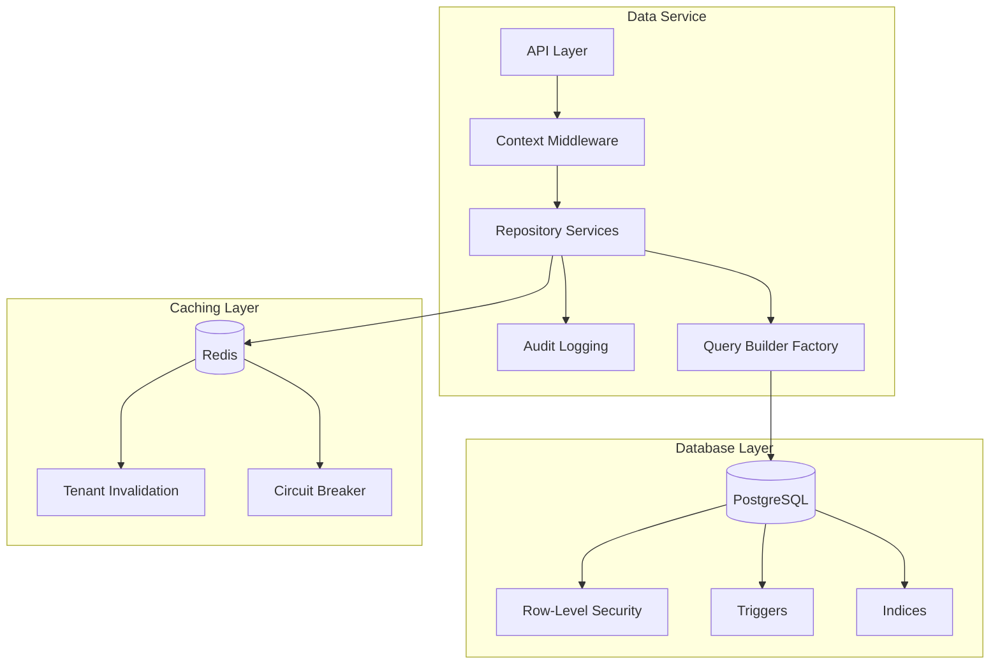

# Multi-Tenant Implementation Guide

This document outlines the multi-tenant architecture implemented in the Data Service for the Smarter Firms platform. The service is designed to provide complete data isolation between different law firms while allowing consultants to access data across multiple firms.

## Architecture Overview

The Smarter Firms data layer implements a multi-tenant architecture using a shared database with row-level security approach:



## Core Principles

1. **Complete Tenant Isolation** - Data from one tenant is never accessible by another tenant
2. **Defense in Depth** - Multiple isolation layers prevent accidental data leakage
3. **Performance Optimization** - Tenant filtering does not impact query performance
4. **Developer Experience** - Tenant isolation is seamless and requires minimal code
5. **Auditability** - All cross-tenant access is thoroughly logged and monitored

## Implementation Layers

Our multi-tenant isolation is implemented at multiple layers of the stack:

### 1. Database Layer

- PostgreSQL Row-Level Security (RLS) policies enforce tenant isolation at the database level
- Every table with tenant data has a `firm_id` column and corresponding RLS policy
- Superuser/admin operations bypass RLS only through explicit procedures
- Indices on `firm_id` columns ensure query performance
- [More details on Row-Level Security implementation](row-level-security.md)

### 2. Repository Layer

- Repository pattern encapsulates all data access logic
- All repositories automatically apply tenant context to queries
- Custom query builders enforce tenant isolation for complex queries
- [More details on Repository Pattern implementation](repository-pattern.md)

### 3. API Layer

- Tenant context middleware extracts tenant information from JWT tokens
- Context is stored in async local storage for the request lifetime
- All data operations validate the tenant context before execution
- Separate endpoints for consultant-specific cross-tenant operations

### 4. Caching Layer

- All cache keys include tenant identifier as prefix
- Tenant-aware cache invalidation strategies
- Cross-tenant data caching for consultant access patterns
- [More details on Cache Invalidation strategy](cache-invalidation.md)

## Tenant Identification

The system identifies tenants through the following methods:

1. From JWT token claims (`firm_id` for law firm users, `cons_firms` for consultants)
2. From explicit HTTP headers (`X-Firm-Context`) for cross-tenant consultant access
3. From query parameters when explicitly required for consultant operations

## Consultant Access Patterns

Consultants require special handling to access data across multiple firms:

```typescript
// Example of consultant cross-firm access in repository layer
class AnalyticsRepository {
  // Regular tenant-scoped access (used by firm users)
  async getMetrics(metric: string, period: string): Promise<MetricData[]> {
    const tenantId = TenantContext.getCurrentTenant();
    if (!tenantId) throw new Error('Tenant context required');
    
    return this.prisma.metrics.findMany({
      where: {
        firmId: tenantId,
        period
      }
    });
  }
  
  // Cross-tenant access for consultants
  async getMetricsForFirms(
    metric: string, 
    period: string, 
    firmIds: string[]
  ): Promise<Record<string, MetricData[]>> {
    const consultantId = TenantContext.getCurrentUser();
    
    // Validate consultant has access to all requested firms
    await this.validateConsultantAccess(consultantId, firmIds);
    
    // Log cross-tenant access
    await this.auditService.logCrossTenantAccess({
      consultantId,
      firmIds,
      resource: 'metrics',
      action: 'read'
    });
    
    // Get data for each firm
    const results: Record<string, MetricData[]> = {};
    
    for (const firmId of firmIds) {
      // Temporarily set context to this firm
      TenantContext.setTemporaryTenant(firmId);
      
      try {
        results[firmId] = await this.prisma.metrics.findMany({
          where: {
            firmId,
            period
          }
        });
      } finally {
        // Always restore original context
        TenantContext.resetTemporaryTenant();
      }
    }
    
    return results;
  }
}
```

## Edge Cases and Security Considerations

### 1. Tenant Switching

- Explicit tenant switching is always logged as a security event
- Temporary tenant context is isolated to individual operations
- Context switching is only allowed for users with cross-tenant permissions

### 2. Shared Data

Some data may be shared across tenants:

- Global reference data (countries, currencies, etc.)
- System-wide configuration
- Anonymized benchmarking data

These tables are specifically exempted from tenant isolation with explicit safeguards.

### 3. Data Export and Import

- Exports are tenant-filtered before data is serialized
- Imports validate tenant context before inserting data
- Bulk operations maintain tenant isolation

### 4. Background Jobs

- Background jobs inherit tenant context from their creation context
- Jobs without tenant context can only access shared data
- Cross-tenant jobs explicitly declare which tenants they access

## Testing and Validation

The multi-tenant architecture is thoroughly tested:

- Unit tests verify repository-level tenant isolation
- Integration tests verify database-level isolation
- End-to-end tests validate API-level isolation
- Chaos testing ensures isolation under failure conditions
- Penetration testing targets tenant isolation boundaries

See [Resilience Testing](resilience-testing.md) for more details.

## Performance Considerations

Multi-tenant filtering adds minimal overhead:

- RLS policies are optimized for performance
- Indices on tenant columns ensure efficient filtering
- Tenant context extraction is cached per request
- Query plans are analyzed to ensure tenant predicates are efficiently applied

See [Query Optimization](query-optimization.md) for more details.

## Monitoring and Alerts

The system monitors tenant isolation with:

- Alerts for suspicious cross-tenant access patterns
- Metrics for tenant context switches
- Logs for all cross-tenant operations
- Regular automated tenant isolation testing 