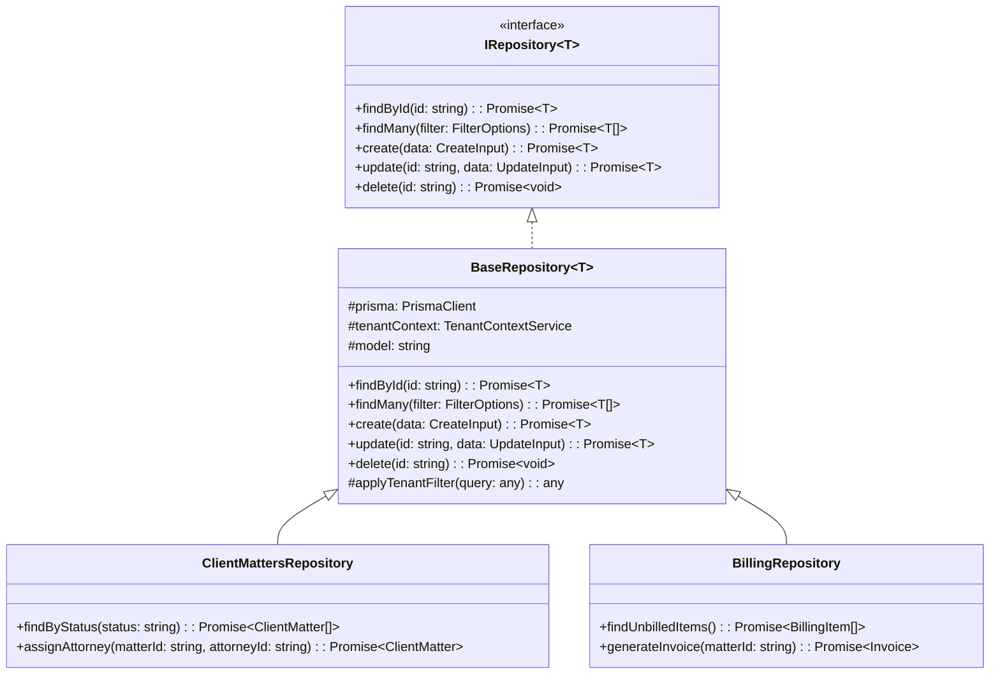

# Repository Pattern Implementation

This document outlines how the repository pattern is implemented in the Data Service to enforce tenant isolation at the application level.

## Overview

The repository pattern provides an abstraction layer between the application's business logic and the data access layer. In the Smarter Firms platform, repositories play a critical role in enforcing tenant isolation by ensuring all database operations are properly scoped to the current tenant.

## Repository Architecture



## Base Repository Implementation

The `BaseRepository` class provides a foundation for all repositories with built-in tenant isolation:

```typescript
import { PrismaClient } from '@prisma/client';
import { TenantContextService } from '../services/tenant-context.service';

export abstract class BaseRepository<T> {
  protected constructor(
    protected readonly prisma: PrismaClient,
    protected readonly tenantContext: TenantContextService,
    protected readonly model: string
  ) {}
  
  /**
   * Find entity by ID with tenant isolation
   */
  async findById(id: string): Promise<T | null> {
    const currentTenant = this.tenantContext.getCurrentTenant();
    if (!currentTenant) {
      throw new Error('Tenant context not set');
    }
    
    // Access Prisma dynamically by model name
    const result = await (this.prisma as any)[this.model].findFirst({
      where: {
        id,
        firmId: currentTenant
      }
    });
    
    return result;
  }
  
  /**
   * Find many entities with tenant isolation
   */
  async findMany(filter: any = {}): Promise<T[]> {
    const currentTenant = this.tenantContext.getCurrentTenant();
    if (!currentTenant) {
      throw new Error('Tenant context not set');
    }
    
    // Apply tenant filter to query
    const query = this.applyTenantFilter({
      where: filter.where || {},
      orderBy: filter.orderBy,
      take: filter.take,
      skip: filter.skip
    });
    
    // Execute query
    const results = await (this.prisma as any)[this.model].findMany(query);
    
    return results;
  }
  
  /**
   * Create entity with tenant ID
   */
  async create(data: any): Promise<T> {
    const currentTenant = this.tenantContext.getCurrentTenant();
    if (!currentTenant) {
      throw new Error('Tenant context not set');
    }
    
    // Add tenant ID to data
    const dataWithTenant = {
      ...data,
      firmId: currentTenant
    };
    
    // Create entity
    const result = await (this.prisma as any)[this.model].create({
      data: dataWithTenant
    });
    
    return result;
  }
  
  /**
   * Update entity with tenant isolation
   */
  async update(id: string, data: any): Promise<T> {
    const currentTenant = this.tenantContext.getCurrentTenant();
    if (!currentTenant) {
      throw new Error('Tenant context not set');
    }
    
    // Update entity with tenant check
    const result = await (this.prisma as any)[this.model].updateMany({
      where: {
        id,
        firmId: currentTenant
      },
      data
    });
    
    // If no rows were updated, entity doesn't exist or belongs to another tenant
    if (result.count === 0) {
      throw new Error(`${this.model} with ID ${id} not found`);
    }
    
    // Return updated entity
    return this.findById(id);
  }
  
  /**
   * Delete entity with tenant isolation
   */
  async delete(id: string): Promise<void> {
    const currentTenant = this.tenantContext.getCurrentTenant();
    if (!currentTenant) {
      throw new Error('Tenant context not set');
    }
    
    // Delete entity with tenant check
    const result = await (this.prisma as any)[this.model].deleteMany({
      where: {
        id,
        firmId: currentTenant
      }
    });
    
    // If no rows were deleted, entity doesn't exist or belongs to another tenant
    if (result.count === 0) {
      throw new Error(`${this.model} with ID ${id} not found`);
    }
  }
  
  /**
   * Apply tenant filter to any query
   */
  protected applyTenantFilter(query: any): any {
    const currentTenant = this.tenantContext.getCurrentTenant();
    
    return {
      ...query,
      where: {
        ...query.where,
        firmId: currentTenant
      }
    };
  }
}
```

## Tenant Context Service

The `TenantContextService` manages tenant context throughout request processing:

```typescript
import { Injectable } from '@nestjs/common';
import { AsyncLocalStorage } from 'async_hooks';

interface TenantContext {
  tenantId: string | null;
  userId: string | null;
  userType: 'LAW_FIRM_USER' | 'CONSULTANT' | 'ADMIN';
  accessibleTenants: string[];
}

@Injectable()
export class TenantContextService {
  private readonly als = new AsyncLocalStorage<TenantContext>();
  
  /**
   * Initialize tenant context for the current request
   */
  initContext(
    tenantId: string | null, 
    userId: string | null,
    userType: 'LAW_FIRM_USER' | 'CONSULTANT' | 'ADMIN' = 'LAW_FIRM_USER',
    accessibleTenants: string[] = []
  ): void {
    const context: TenantContext = {
      tenantId,
      userId,
      userType,
      accessibleTenants
    };
    
    // Run callback with this context
    this.als.enterWith(context);
  }
  
  /**
   * Get current tenant ID
   */
  getCurrentTenant(): string | null {
    const context = this.als.getStore();
    return context?.tenantId || null;
  }
  
  /**
   * Get current user ID
   */
  getCurrentUser(): string | null {
    const context = this.als.getStore();
    return context?.userId || null;
  }
  
  /**
   * Get user type
   */
  getUserType(): 'LAW_FIRM_USER' | 'CONSULTANT' | 'ADMIN' {
    const context = this.als.getStore();
    return context?.userType || 'LAW_FIRM_USER';
  }
  
  /**
   * Get tenants accessible to current user
   */
  getAccessibleTenants(): string[] {
    const context = this.als.getStore();
    return context?.accessibleTenants || [];
  }
  
  /**
   * Check if user can access a specific tenant
   */
  canAccessTenant(tenantId: string): boolean {
    const context = this.als.getStore();
    
    if (!context) return false;
    
    // Admin can access all tenants
    if (context.userType === 'ADMIN') return true;
    
    // Current tenant is always accessible
    if (context.tenantId === tenantId) return true;
    
    // Check if tenant is in accessible tenants for consultants
    if (context.userType === 'CONSULTANT') {
      return context.accessibleTenants.includes(tenantId);
    }
    
    return false;
  }
  
  /**
   * Run operation with temporary tenant context
   */
  async runWithTenant<T>(tenantId: string, callback: () => Promise<T>): Promise<T> {
    const context = this.als.getStore();
    if (!context) {
      throw new Error('No tenant context initialized');
    }
    
    // Verify access to tenant
    if (!this.canAccessTenant(tenantId)) {
      throw new Error(`No access to tenant ${tenantId}`);
    }
    
    // Save original tenant
    const originalTenant = context.tenantId;
    
    try {
      // Set temporary tenant
      context.tenantId = tenantId;
      
      // Run callback
      return await callback();
    } finally {
      // Restore original tenant
      context.tenantId = originalTenant;
    }
  }
}
```

## Specific Repository Examples

### Client Matters Repository

```typescript
import { Injectable } from '@nestjs/common';
import { PrismaClient, ClientMatter } from '@prisma/client';
import { BaseRepository } from './base.repository';
import { TenantContextService } from '../services/tenant-context.service';

@Injectable()
export class ClientMattersRepository extends BaseRepository<ClientMatter> {
  constructor(
    private readonly prismaService: PrismaClient,
    private readonly tenantContextService: TenantContextService
  ) {
    super(prismaService, tenantContextService, 'clientMatter');
  }
  
  /**
   * Find matters by status
   */
  async findByStatus(status: string): Promise<ClientMatter[]> {
    return this.findMany({
      where: { status }
    });
  }
  
  /**
   * Assign attorney to matter
   */
  async assignAttorney(matterId: string, attorneyId: string): Promise<ClientMatter> {
    // First verify matter exists in tenant
    await this.findById(matterId);
    
    // Update the matter
    return this.update(matterId, {
      attorneyId,
      updatedAt: new Date()
    });
  }
}
```

### Cross-Tenant Repository for Consultants

```typescript
import { Injectable } from '@nestjs/common';
import { PrismaClient } from '@prisma/client';
import { TenantContextService } from '../services/tenant-context.service';
import { AuditService } from '../services/audit.service';

interface MetricData {
  id: string;
  firmId: string;
  name: string;
  value: number;
  period: string;
}

@Injectable()
export class ConsultantAnalyticsRepository {
  constructor(
    private readonly prisma: PrismaClient,
    private readonly tenantContext: TenantContextService,
    private readonly auditService: AuditService
  ) {}
  
  /**
   * Get metrics for multiple firms (consultant use case)
   */
  async getMetricsForFirms(
    metric: string,
    period: string,
    firmIds: string[]
  ): Promise<Record<string, MetricData[]>> {
    // Verify user is a consultant
    if (this.tenantContext.getUserType() !== 'CONSULTANT') {
      throw new Error('Only consultants can access cross-tenant data');
    }
    
    // Get accessible tenants
    const accessibleTenants = this.tenantContext.getAccessibleTenants();
    
    // Verify access to all requested firms
    const invalidFirms = firmIds.filter(id => !accessibleTenants.includes(id));
    if (invalidFirms.length > 0) {
      throw new Error(`No access to firms: ${invalidFirms.join(', ')}`);
    }
    
    // Log cross-tenant access
    await this.auditService.logCrossTenantAccess({
      userId: this.tenantContext.getCurrentUser(),
      firmIds,
      resource: 'metrics',
      action: 'read'
    });
    
    // Get data for each firm
    const results: Record<string, MetricData[]> = {};
    
    for (const firmId of firmIds) {
      // Run with temporary tenant context
      results[firmId] = await this.tenantContext.runWithTenant(firmId, async () => {
        return this.prisma.metric.findMany({
          where: {
            firmId,
            name: metric,
            period
          }
        });
      });
    }
    
    return results;
  }
}
```

## Integration with Dependency Injection

The repositories are registered with NestJS dependency injection:

```typescript
import { Module } from '@nestjs/common';
import { PrismaService } from './prisma.service';
import { TenantContextService } from './tenant-context.service';
import { AuditService } from './audit.service';
import { ClientMattersRepository } from './repositories/client-matters.repository';
import { BillingRepository } from './repositories/billing.repository';
import { ConsultantAnalyticsRepository } from './repositories/consultant-analytics.repository';

@Module({
  providers: [
    PrismaService,
    TenantContextService,
    AuditService,
    ClientMattersRepository,
    BillingRepository,
    ConsultantAnalyticsRepository,
  ],
  exports: [
    ClientMattersRepository,
    BillingRepository,
    ConsultantAnalyticsRepository,
  ],
})
export class DataModule {}
```

## Middleware for Tenant Context

The tenant context is set using middleware:

```typescript
import { Injectable, NestMiddleware } from '@nestjs/common';
import { Request, Response, NextFunction } from 'express';
import { TenantContextService } from './tenant-context.service';
import { JwtService } from '@nestjs/jwt';

@Injectable()
export class TenantContextMiddleware implements NestMiddleware {
  constructor(
    private readonly tenantContext: TenantContextService,
    private readonly jwtService: JwtService
  ) {}
  
  async use(req: Request, res: Response, next: NextFunction) {
    // Extract JWT token from Authorization header
    const authHeader = req.headers.authorization;
    if (!authHeader) {
      // No auth header, no tenant context
      next();
      return;
    }
    
    const token = authHeader.split(' ')[1];
    if (!token) {
      next();
      return;
    }
    
    try {
      // Verify and decode token
      const decoded = this.jwtService.verify(token);
      
      // Extract tenant info from token
      const tenantId = decoded.firm_id || null;
      const userId = decoded.sub || null;
      const userType = decoded.type || 'LAW_FIRM_USER';
      const accessibleTenants = decoded.cons_firms || [];
      
      // Set current tenant context
      this.tenantContext.initContext(tenantId, userId, userType, accessibleTenants);
      
      // Continue request processing
      next();
    } catch (error) {
      // Invalid token, no tenant context
      next();
    }
  }
}
```

## Testing Repositories

Example test for tenant isolation in repositories:

```typescript
import { Test } from '@nestjs/testing';
import { PrismaClient } from '@prisma/client';
import { TenantContextService } from '../src/services/tenant-context.service';
import { ClientMattersRepository } from '../src/repositories/client-matters.repository';

describe('ClientMattersRepository', () => {
  let repository: ClientMattersRepository;
  let tenantContext: TenantContextService;
  let prisma: PrismaClient;
  
  beforeEach(async () => {
    const moduleRef = await Test.createTestingModule({
      providers: [
        ClientMattersRepository,
        {
          provide: PrismaClient,
          useValue: {
            clientMatter: {
              findFirst: jest.fn(),
              findMany: jest.fn(),
              create: jest.fn(),
              updateMany: jest.fn(),
              deleteMany: jest.fn(),
            },
          },
        },
        {
          provide: TenantContextService,
          useValue: {
            getCurrentTenant: jest.fn(),
            initContext: jest.fn(),
          },
        },
      ],
    }).compile();
    
    repository = moduleRef.get<ClientMattersRepository>(ClientMattersRepository);
    tenantContext = moduleRef.get<TenantContextService>(TenantContextService);
    prisma = moduleRef.get<PrismaClient>(PrismaClient);
  });
  
  describe('findById', () => {
    it('should throw error if tenant context not set', async () => {
      // Mock tenant context not set
      jest.spyOn(tenantContext, 'getCurrentTenant').mockReturnValue(null);
      
      // Expect error
      await expect(repository.findById('matter-id')).rejects.toThrow('Tenant context not set');
    });
    
    it('should include tenant filter in query', async () => {
      // Mock tenant context
      jest.spyOn(tenantContext, 'getCurrentTenant').mockReturnValue('tenant-1');
      
      // Mock Prisma response
      jest.spyOn(prisma.clientMatter, 'findFirst').mockResolvedValue({
        id: 'matter-id',
        name: 'Test Matter',
        firmId: 'tenant-1',
      });
      
      // Call repository
      await repository.findById('matter-id');
      
      // Verify Prisma was called with tenant filter
      expect(prisma.clientMatter.findFirst).toHaveBeenCalledWith({
        where: {
          id: 'matter-id',
          firmId: 'tenant-1',
        },
      });
    });
  });
});
```

## Best Practices for Repository Implementation

1. **Always extend the BaseRepository** - Use the base repository to inherit tenant isolation
2. **Never bypass tenant filtering** - All database operations should respect tenant context
3. **Use runWithTenant for cross-tenant operations** - For consultant-specific features
4. **Audit all cross-tenant access** - Log any operation that accesses multiple tenants
5. **Test tenant isolation rigorously** - Verify tenant filtering in all repository methods
6. **Keep tenant ID in the database layer** - Never rely on application code to filter by tenant 