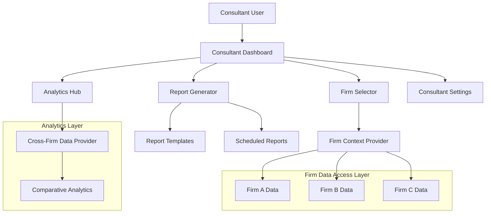

# Consultant Dashboard Implementation

This document outlines the implementation details of the consultant dashboard in the Smarter Firms platform, focusing on multi-firm access capabilities and specialized consultant features.

## Architecture Overview

The consultant dashboard provides a unified interface for consultants to access data from multiple law firms while maintaining strict security boundaries.



## Firm Selection and Context Management

### Firm Selector Component

```typescript
// Firm selector with quick switching capabilities
interface Firm {
  id: string;
  name: string;
  logo?: string;
  industry?: string;
  lastAccessed?: Date;
  role?: string;
}

const FirmSelector: React.FC = () => {
  const { firms, currentFirmId, switchFirm } = useFirmContext();
  const [searchTerm, setSearchTerm] = useState('');
  const [sortBy, setSortBy] = useState<'name' | 'lastAccessed'>('lastAccessed');
  
  // Filter and sort firms
  const filteredFirms = useMemo(() => {
    return firms
      .filter(firm => 
        firm.name.toLowerCase().includes(searchTerm.toLowerCase()) ||
        firm.industry?.toLowerCase().includes(searchTerm.toLowerCase())
      )
      .sort((a, b) => {
        if (sortBy === 'name') {
          return a.name.localeCompare(b.name);
        } else {
          return new Date(b.lastAccessed || 0).getTime() - 
                 new Date(a.lastAccessed || 0).getTime();
        }
      });
  }, [firms, searchTerm, sortBy]);
  
  // Handle firm selection
  const handleFirmSelect = async (firmId: string) => {
    try {
      // Check for unsaved changes before switching
      if (await confirmContextSwitch()) {
        await switchFirm(firmId);
      }
    } catch (error) {
      // Handle switch error
      console.error('Failed to switch firm context', error);
    }
  };
  
  return (
    <div className="firm-selector">
      <div className="search-container">
        <input
          type="text"
          placeholder="Search firms..."
          value={searchTerm}
          onChange={(e) => setSearchTerm(e.target.value)}
        />
        <select 
          value={sortBy}
          onChange={(e) => setSortBy(e.target.value as 'name' | 'lastAccessed')}
        >
          <option value="lastAccessed">Recently Accessed</option>
          <option value="name">Alphabetical</option>
        </select>
      </div>
      
      <ul className="firm-list">
        {filteredFirms.map(firm => (
          <li 
            key={firm.id} 
            className={`firm-item ${firm.id === currentFirmId ? 'active' : ''}`}
            onClick={() => handleFirmSelect(firm.id)}
          >
            {firm.logo && }
            <div className="firm-info">
              <h3>{firm.name}</h3>
              {firm.industry && <span className="industry">{firm.industry}</span>}
              {firm.role && <span className="role">{firm.role}</span>}
            </div>
            {firm.lastAccessed && (
              <span className="last-accessed">
                {formatRelativeTime(firm.lastAccessed)}
              </span>
            )}
          </li>
        ))}
      </ul>
    </div>
  );
};
```

### Firm Context Provider

```typescript
// Context provider for managing current firm context
interface FirmContextProps {
  firms: Firm[];
  currentFirmId: string | null;
  currentFirm: Firm | null;
  switchFirm: (firmId: string) => Promise<void>;
  hasAccess: (firmId: string) => boolean;
  refreshFirmList: () => Promise<void>;
}

const FirmContext = createContext<FirmContextProps | undefined>(undefined);

const FirmContextProvider: React.FC = ({ children }) => {
  const [firms, setFirms] = useState<Firm[]>([]);
  const [currentFirmId, setCurrentFirmId] = useState<string | null>(null);
  const { user } = useAuth();
  const { startLoading, endLoading } = useLoadingContext();
  
  // Get current firm object
  const currentFirm = useMemo(() => {
    return firms.find(firm => firm.id === currentFirmId) || null;
  }, [firms, currentFirmId]);
  
  // Load firms when user changes
  useEffect(() => {
    if (user) {
      refreshFirmList();
    }
  }, [user]);
  
  // Fetch firms accessible to the user
  const refreshFirmList = async () => {
    try {
      startLoading('fetch-firms', {
        type: LoadingStateType.INITIAL_LOAD,
        message: 'Loading accessible firms'
      });
      
      const response = await axios.get('/api/firms/accessible');
      setFirms(response.data);
      
      // Set current firm if not already set
      if (!currentFirmId && response.data.length > 0) {
        const lastFirmId = localStorage.getItem('lastFirmId');
        const initialFirm = lastFirmId ? 
          response.data.find((f: Firm) => f.id === lastFirmId) : 
          response.data[0];
          
        if (initialFirm) {
          setCurrentFirmId(initialFirm.id);
          localStorage.setItem('lastFirmId', initialFirm.id);
        }
      }
    } catch (error) {
      console.error('Failed to load firms', error);
    } finally {
      endLoading('fetch-firms');
    }
  };
  
  // Switch to a different firm
  const switchFirm = async (firmId: string) => {
    if (firmId === currentFirmId) return;
    
    const loadingId = `switch-firm-${firmId}`;
    try {
      // Check if user has access to requested firm
      if (!hasAccess(firmId)) {
        throw new Error('No access to this firm');
      }
      
      startLoading(loadingId, {
        type: LoadingStateType.FIRM_SWITCH,
        message: `Switching to ${firms.find(f => f.id === firmId)?.name || firmId}`,
        targetFirm: firmId,
        sourceFirm: currentFirmId || undefined
      });
      
      // Update last accessed timestamp
      await axios.post(`/api/firms/${firmId}/access-log`);
      
      // Update local state
      setCurrentFirmId(firmId);
      localStorage.setItem('lastFirmId', firmId);
      
      // Update firm list with new timestamp
      setFirms(prev => 
        prev.map(firm => 
          firm.id === firmId 
            ? { ...firm, lastAccessed: new Date() } 
            : firm
        )
      );
      
      // Log security event
      securityLogger.logEvent({
        type: SecurityEventType.FIRM_SWITCH,
        firmId,
      });
    } catch (error) {
      console.error('Failed to switch firm context', error);
      throw error;
    } finally {
      endLoading(loadingId);
    }
  };
  
  // Check if user has access to a firm
  const hasAccess = (firmId: string) => {
    return firms.some(firm => firm.id === firmId);
  };
  
  return (
    <FirmContext.Provider value={{
      firms,
      currentFirmId,
      currentFirm,
      switchFirm,
      hasAccess,
      refreshFirmList
    }}>
      {children}
    </FirmContext.Provider>
  );
};

// Custom hook for accessing firm context
const useFirmContext = () => {
  const context = useContext(FirmContext);
  if (!context) {
    throw new Error('useFirmContext must be used within a FirmContextProvider');
  }
  return context;
};
```

## Multi-Firm Analytics

The consultant dashboard provides tools for cross-firm analysis with appropriate data isolation and permissions.

### Comparative Analytics Component

```typescript
// Component for comparing metrics across multiple firms
interface ComparativeAnalyticsProps {
  metric: string;
  firmIds: string[];
  period: 'week' | 'month' | 'quarter' | 'year';
  anonymize?: boolean;
}

const ComparativeAnalytics: React.FC<ComparativeAnalyticsProps> = ({
  metric,
  firmIds,
  period,
  anonymize = false
}) => {
  const [data, setData] = useState<Record<string, any[]>>({});
  const [loading, setLoading] = useState(true);
  const [error, setError] = useState<Error | null>(null);
  const { firms } = useFirmContext();
  
  useEffect(() => {
    const fetchData = async () => {
      setLoading(true);
      setError(null);
      
      try {
        // Create a map to store data by firm
        const dataMap: Record<string, any[]> = {};
        
        // Fetch data for each firm in parallel
        await Promise.all(firmIds.map(async (firmId) => {
          try {
            // Fetch metrics for this firm
            const response = await axios.get(`/api/analytics/${metric}`, {
              params: { period },
              headers: { 'X-Firm-Context': firmId }
            });
            
            // Store in the map
            dataMap[firmId] = response.data;
          } catch (err) {
            console.error(`Failed to fetch data for firm ${firmId}`, err);
            // Store empty array for failed requests
            dataMap[firmId] = [];
          }
        }));
        
        setData(dataMap);
      } catch (err) {
        setError(err as Error);
      } finally {
        setLoading(false);
      }
    };
    
    fetchData();
  }, [metric, firmIds.join(','), period]);
  
  if (loading) {
    return <LoadingIndicator message={`Loading ${metric} data...`} />;
  }
  
  if (error) {
    return <ErrorState error={error} />;
  }
  
  // Process data for display, applying anonymization if needed
  const processedData = useMemo(() => {
    return firmIds.map(firmId => {
      const firmData = data[firmId] || [];
      const firm = firms.find(f => f.id === firmId);
      
      return {
        id: firmId,
        name: anonymize ? `Firm ${firmIds.indexOf(firmId) + 1}` : (firm?.name || 'Unknown'),
        data: firmData,
      };
    });
  }, [data, firmIds, firms, anonymize]);
  
  return (
    <div className="comparative-analytics">
      <h2>{getMetricDisplayName(metric)} Comparison</h2>
      <p className="period">{formatPeriod(period)}</p>
      
      {anonymize && (
        <div className="anonymized-notice">
          <InfoIcon /> Firm identities are anonymized for data privacy
        </div>
      )}
      
      <div className="chart-container">
        <Chart 
          type="bar" 
          data={processChartData(processedData, metric)} 
          options={getChartOptions(metric, period)}
        />
      </div>
      
      <div className="metrics-summary">
        <MetricsSummary data={processedData} metric={metric} />
      </div>
    </div>
  );
};
```

### Benchmarking System

```typescript
// Benchmarking calculation system
interface BenchmarkData {
  metric: string;
  firmId: string;
  value: number;
  industryAverage: number;
  topQuartile: number;
  percentile: number;
}

// Function to calculate benchmarks for a firm
const calculateBenchmarks = async (
  firmId: string,
  metrics: string[]
): Promise<BenchmarkData[]> => {
  // Gather industry data (anonymized)
  const response = await axios.get('/api/analytics/benchmarks', {
    params: { metrics: metrics.join(',') },
    headers: { 'X-Firm-Context': firmId }
  });
  
  const { firmMetrics, industryData } = response.data;
  
  // Calculate benchmark data for each metric
  return metrics.map(metric => {
    const firmValue = firmMetrics[metric] || 0;
    const industryValues = industryData[metric] || [];
    
    // Sort values for percentile calculation
    const sortedValues = [...industryValues].sort((a, b) => a - b);
    
    // Calculate industry statistics
    const industryAverage = calculateAverage(industryValues);
    const topQuartileIndex = Math.floor(sortedValues.length * 0.75);
    const topQuartile = sortedValues[topQuartileIndex] || 0;
    
    // Calculate firm's percentile
    const percentile = calculatePercentile(firmValue, sortedValues);
    
    return {
      metric,
      firmId,
      value: firmValue,
      industryAverage,
      topQuartile,
      percentile
    };
  });
};

// Helper to calculate percentile
const calculatePercentile = (value: number, sortedValues: number[]): number => {
  if (sortedValues.length === 0) return 0;
  
  // Find position of value in sorted array
  let position = sortedValues.findIndex(v => v >= value);
  if (position === -1) {
    position = sortedValues.length;
  }
  
  return Math.round((position / sortedValues.length) * 100);
};
```

## Consultant-Specific Features

### Activity Tracking

```typescript
// Activity tracking for consultant access
interface ActivityLogEntry {
  id: string;
  consultantId: string;
  firmId: string;
  action: string;
  resource: string;
  timestamp: Date;
  ipAddress?: string;
  metadata?: Record<string, any>;
}

// Record consultant activity
const logConsultantActivity = async (
  firmId: string,
  action: string,
  resource: string,
  metadata?: Record<string, any>
): Promise<void> => {
  try {
    await axios.post('/api/activity-log', {
      firmId,
      action,
      resource,
      metadata
    });
  } catch (error) {
    console.error('Failed to log activity', error);
    // Continue execution even if logging fails
  }
};

// Activity log component
const ActivityLogViewer: React.FC = () => {
  const [logs, setLogs] = useState<ActivityLogEntry[]>([]);
  const [loading, setLoading] = useState(true);
  const [filters, setFilters] = useState({
    firmId: '',
    action: '',
    startDate: '',
    endDate: ''
  });
  
  // Fetch activity logs
  const fetchLogs = async () => {
    setLoading(true);
    try {
      const response = await axios.get('/api/activity-log', {
        params: {
          ...filters,
          limit: 100,
          offset: 0
        }
      });
      setLogs(response.data.logs);
    } catch (error) {
      console.error('Failed to fetch activity logs', error);
    } finally {
      setLoading(false);
    }
  };
  
  useEffect(() => {
    fetchLogs();
  }, [JSON.stringify(filters)]);
  
  // Filter handlers
  const handleFilterChange = (key: string, value: string) => {
    setFilters(prev => ({ ...prev, [key]: value }));
  };
  
  return (
    <div className="activity-log-viewer">
      <h2>Activity Log</h2>
      
      <div className="filters">
        {/* Filter UI components */}
      </div>
      
      {loading ? (
        <LoadingIndicator message="Loading activity logs..." />
      ) : (
        <table className="activity-table">
          <thead>
            <tr>
              <th>Timestamp</th>
              <th>Firm</th>
              <th>Action</th>
              <th>Resource</th>
              <th>Details</th>
            </tr>
          </thead>
          <tbody>
            {logs.map(log => (
              <tr key={log.id}>
                <td>{formatDateTime(log.timestamp)}</td>
                <td>{getFirmName(log.firmId)}</td>
                <td>{formatAction(log.action)}</td>
                <td>{log.resource}</td>
                <td>
                  {log.metadata && (
                    <button onClick={() => viewDetails(log.metadata)}>
                      View Details
                    </button>
                  )}
                </td>
              </tr>
            ))}
          </tbody>
        </table>
      )}
    </div>
  );
};
```

### Report Generation

```typescript
// Report template system
interface ReportTemplate {
  id: string;
  name: string;
  description: string;
  sections: ReportSection[];
  isGlobal: boolean;
  createdBy: string;
}

interface ReportSection {
  title: string;
  type: 'metrics' | 'chart' | 'table' | 'text';
  content: any;
  firmSpecific: boolean;
}

// Report generator component
const ReportGenerator: React.FC = () => {
  const [selectedTemplate, setSelectedTemplate] = useState<ReportTemplate | null>(null);
  const [selectedFirms, setSelectedFirms] = useState<string[]>([]);
  const [reportConfig, setReportConfig] = useState({
    title: '',
    period: 'month' as 'week' | 'month' | 'quarter' | 'year',
    includeComparisons: true,
    anonymizeFirms: false
  });
  const { firms } = useFirmContext();
  
  // Fetch templates
  useEffect(() => {
    const fetchTemplates = async () => {
      try {
        const response = await axios.get('/api/report-templates');
        if (response.data.length > 0) {
          setSelectedTemplate(response.data[0]);
        }
      } catch (error) {
        console.error('Failed to fetch report templates', error);
      }
    };
    
    fetchTemplates();
  }, []);
  
  // Generate report
  const generateReport = async () => {
    if (!selectedTemplate || selectedFirms.length === 0) {
      return;
    }
    
    try {
      const response = await axios.post('/api/reports/generate', {
        templateId: selectedTemplate.id,
        firmIds: selectedFirms,
        config: reportConfig
      }, {
        responseType: 'blob'
      });
      
      // Create download link
      const url = window.URL.createObjectURL(new Blob([response.data]));
      const link = document.createElement('a');
      link.href = url;
      link.setAttribute('download', `${reportConfig.title || 'report'}.pdf`);
      document.body.appendChild(link);
      link.click();
      link.remove();
      
      // Log activity
      await logConsultantActivity(
        'multiple',
        'generate_report',
        'report',
        { 
          templateId: selectedTemplate.id, 
          firmCount: selectedFirms.length,
          firms: reportConfig.anonymizeFirms ? undefined : selectedFirms
        }
      );
    } catch (error) {
      console.error('Failed to generate report', error);
    }
  };
  
  return (
    <div className="report-generator">
      <h2>Generate Report</h2>
      
      <div className="template-selector">
        {/* Template selection UI */}
      </div>
      
      <div className="firm-selector">
        <h3>Select Firms</h3>
        {firms.map(firm => (
          <div key={firm.id} className="firm-checkbox">
            <input
              type="checkbox"
              id={`firm-${firm.id}`}
              checked={selectedFirms.includes(firm.id)}
              onChange={() => toggleFirmSelection(firm.id)}
            />
            <label htmlFor={`firm-${firm.id}`}>{firm.name}</label>
          </div>
        ))}
      </div>
      
      <div className="report-config">
        {/* Configuration options */}
      </div>
      
      <button 
        className="generate-button"
        disabled={!selectedTemplate || selectedFirms.length === 0}
        onClick={generateReport}
      >
        Generate Report
      </button>
    </div>
  );
};
```

## Permission Management System

The consultant dashboard implements a role-based permission system to control access to firm data.

### Permission Model

```typescript
// Permission types
enum PermissionType {
  VIEW_FIRM_DATA = 'view_firm_data',
  CREATE_REPORTS = 'create_reports',
  VIEW_FINANCIAL = 'view_financial',
  VIEW_CASE_DETAILS = 'view_case_details',
  VIEW_CLIENT_INFO = 'view_client_info',
  VIEW_STAFF_PERFORMANCE = 'view_staff_performance',
  BENCHMARK_FIRM = 'benchmark_firm',
  SCHEDULE_REPORTS = 'schedule_reports'
}

// Permission levels
enum PermissionLevel {
  NONE = 'none',           // No access
  LIMITED = 'limited',     // Restricted access
  STANDARD = 'standard',   // Normal access
  FULL = 'full'            // Full access
}

// Permission definition
interface Permission {
  type: PermissionType;
  level: PermissionLevel;
  firmId: string;
  constraints?: Record<string, any>; // Additional restrictions
}

// User permissions hook
const usePermissions = () => {
  const { user } = useAuth();
  const [permissions, setPermissions] = useState<Permission[]>([]);
  const [loading, setLoading] = useState(true);
  
  // Fetch permissions on user change
  useEffect(() => {
    const fetchPermissions = async () => {
      if (!user) {
        setPermissions([]);
        setLoading(false);
        return;
      }
      
      try {
        const response = await axios.get('/api/permissions');
        setPermissions(response.data);
      } catch (error) {
        console.error('Failed to fetch permissions', error);
        setPermissions([]);
      } finally {
        setLoading(false);
      }
    };
    
    fetchPermissions();
  }, [user]);
  
  // Check if user has permission
  const hasPermission = (
    type: PermissionType,
    firmId: string,
    requiredLevel: PermissionLevel = PermissionLevel.STANDARD
  ): boolean => {
    if (loading || !user) return false;
    
    const permission = permissions.find(p => 
      p.type === type && p.firmId === firmId
    );
    
    if (!permission) return false;
    
    const levelValues = {
      [PermissionLevel.NONE]: 0,
      [PermissionLevel.LIMITED]: 1,
      [PermissionLevel.STANDARD]: 2,
      [PermissionLevel.FULL]: 3
    };
    
    return levelValues[permission.level] >= levelValues[requiredLevel];
  };
  
  return {
    permissions,
    loading,
    hasPermission
  };
};
```

### Access Control Component

```typescript
// Component to restrict access based on permissions
interface RestrictedContentProps {
  permissionType: PermissionType;
  firmId: string;
  requiredLevel?: PermissionLevel;
  fallback?: React.ReactNode;
  children: React.ReactNode;
}

const RestrictedContent: React.FC<RestrictedContentProps> = ({
  permissionType,
  firmId,
  requiredLevel = PermissionLevel.STANDARD,
  fallback,
  children
}) => {
  const { hasPermission, loading } = usePermissions();
  
  if (loading) {
    return <LoadingIndicator size="small" />;
  }
  
  if (!hasPermission(permissionType, firmId, requiredLevel)) {
    return fallback || (
      <div className="permission-denied">
        <LockIcon />
        <p>You don't have permission to view this content</p>
      </div>
    );
  }
  
  return <>{children}</>;
};
```

## Integration with Auth Service

The consultant dashboard integrates with the Auth Service for JWT validation, permissions, and session management.

```typescript
// Auth service integration
const ConsultantAuthService = {
  // Initialize consultant session
  async initializeSession(): Promise<void> {
    try {
      // Validate token and permissions
      const response = await axios.get('/api/auth/validate-consultant');
      
      // Check if 2FA is required but not completed
      if (response.data.requires2FA && !response.data.has2FA) {
        // Redirect to 2FA setup
        window.location.href = '/setup-2fa';
        return;
      }
      
      // Check if terms acceptance is required
      if (!response.data.hasAcceptedTerms) {
        // Redirect to terms acceptance
        window.location.href = '/accept-terms';
        return;
      }
      
      // Initialize security context
      await initializeSecurity();
      
      // Log successful initialization
      console.log('Consultant session initialized successfully');
    } catch (error) {
      console.error('Failed to initialize consultant session', error);
      // Redirect to login
      window.location.href = '/login?error=session_invalid';
    }
  },
  
  // Check if user is a consultant
  isConsultant(): boolean {
    const user = getUser();
    return user?.type === 'CONSULTANT';
  },
  
  // Get consultant-specific session settings
  getSessionSettings(): { 
    sessionTimeout: number;
    requiresPeriodicReauth: boolean;
    maxConcurrentSessions: number;
  } {
    return {
      sessionTimeout: 60 * 60 * 1000, // 1 hour (shorter than normal users)
      requiresPeriodicReauth: true,
      maxConcurrentSessions: 1 // Consultants limited to one session
    };
  }
};
```

## Conclusion

The consultant dashboard provides a comprehensive interface for consultants to access and analyze data from multiple law firms, with robust security measures and permission controls. 