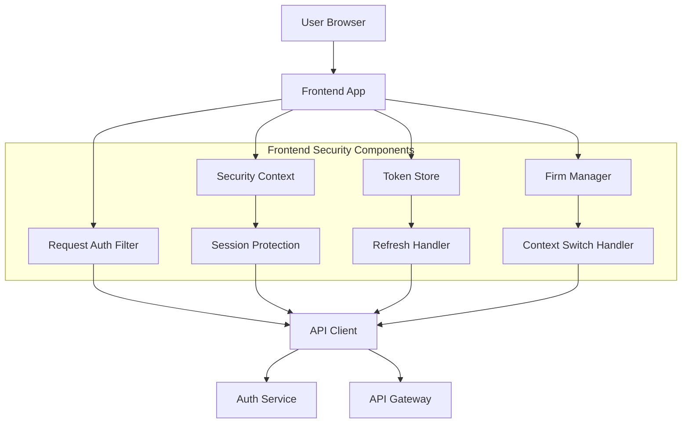
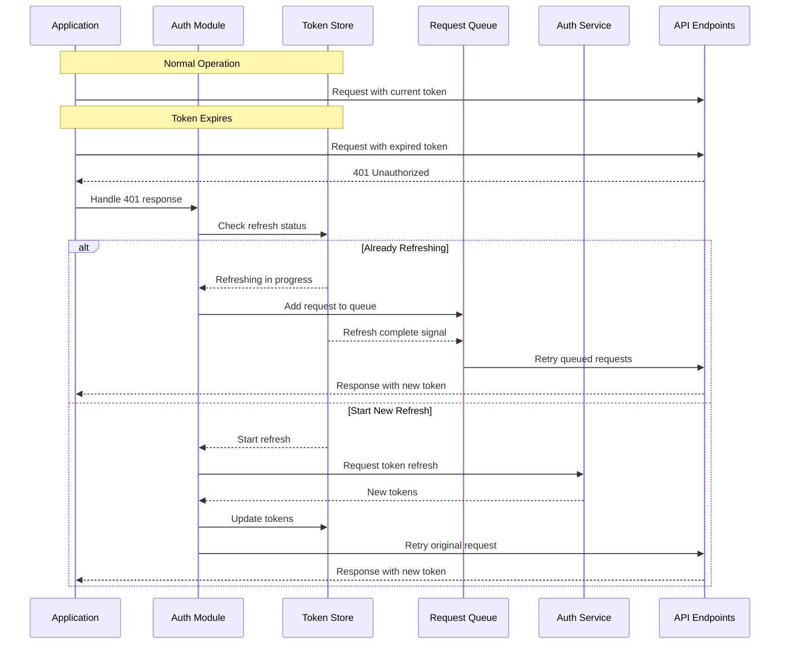

# Frontend Authentication Implementation

This document outlines the implementation details of authentication, security, and session management in the Smarter Firms frontend application.

## Architecture Overview

The frontend authentication system implements a comprehensive security model that interacts with the Auth Service while providing a seamless user experience, particularly for consultants accessing multiple law firm accounts.



## Session Fingerprinting

Session fingerprinting provides an additional layer of security by verifying that a session originated from the expected device and browser.

### Implementation Details

```typescript
// Session fingerprint composition
interface SessionFingerprint {
  deviceSignature: string;    // Device characteristics hash
  canvasFingerprint: string;  // Canvas rendering characteristics
  timeZone: string;           // User's timezone
  languages: string[];        // Browser language preferences
  colorDepth: number;         // Screen color depth
  screenResolution: string;   // Screen resolution
  userAgent: string;          // Sanitized user agent
  timestamp: number;          // Creation timestamp
}

// Risk level assessment
enum RiskLevel {
  LOW = 'low',
  MEDIUM = 'medium',
  HIGH = 'high',
  CRITICAL = 'critical'
}

// Security score calculation
const calculateSecurityScore = (
  storedFingerprint: SessionFingerprint,
  currentFingerprint: SessionFingerprint
): { score: number; riskLevel: RiskLevel } => {
  let score = 100;
  
  // Exact device signature match is critical
  if (storedFingerprint.deviceSignature !== currentFingerprint.deviceSignature) {
    score -= 40;
  }
  
  // Canvas fingerprint is highly reliable
  if (storedFingerprint.canvasFingerprint !== currentFingerprint.canvasFingerprint) {
    score -= 30;
  }
  
  // Other factors affect score less significantly
  if (storedFingerprint.timeZone !== currentFingerprint.timeZone) {
    score -= 15;
  }
  
  if (storedFingerprint.screenResolution !== currentFingerprint.screenResolution) {
    score -= 10;
  }
  
  // Determine risk level based on score
  let riskLevel: RiskLevel = RiskLevel.LOW;
  if (score < 70) riskLevel = RiskLevel.CRITICAL;
  else if (score < 80) riskLevel = RiskLevel.HIGH;
  else if (score < 90) riskLevel = RiskLevel.MEDIUM;
  
  return { score, riskLevel };
};
```

### Integration with Auth Flow

1. During login, the frontend generates a fingerprint and sends it to the Auth Service
2. The fingerprint is stored with the session
3. On token refresh, a new fingerprint is generated and compared with the stored one
4. Significant discrepancies trigger additional verification or session termination

### Security Score System

The security score system evaluates the likelihood that the current session is legitimate:

| Score Range | Risk Level | Action |
|-------------|------------|--------|
| 90-100 | Low | Continue normally |
| 80-89 | Medium | Monitor closely, log suspicious activity |
| 70-79 | High | Prompt for additional verification |
| <70 | Critical | Terminate session, require full re-authentication |

## Token Refresh Implementation

The token refresh system ensures uninterrupted API access by handling JWT expiration transparently.

### Architecture



### Implementation Details

```typescript
// Token store with request queue
class TokenRefreshManager {
  private refreshPromise: Promise<string> | null = null;
  private requestQueue: Array<{
    config: AxiosRequestConfig;
    resolve: (value: any) => void;
    reject: (reason: any) => void;
  }> = [];

  // Get active token or trigger refresh
  async getToken(): Promise<string> {
    if (this.isTokenExpired()) {
      return this.refreshToken();
    }
    return this.getAccessToken();
  }

  // Refresh token with queuing mechanism
  private async refreshToken(): Promise<string> {
    // If already refreshing, return the existing promise
    if (this.refreshPromise) {
      return this.refreshPromise;
    }

    // Start new refresh
    this.refreshPromise = new Promise(async (resolve, reject) => {
      try {
        const response = await axios.post('/auth/token', {
          grantType: 'refresh_token',
          fingerprint: await this.generateFingerprint()
        });
        
        this.setTokens(response.data.accessToken);
        
        // Process queued requests
        this.processQueue(null);
        
        resolve(response.data.accessToken);
      } catch (error) {
        // Failed to refresh
        this.processQueue(error);
        reject(error);
      } finally {
        this.refreshPromise = null;
      }
    });

    return this.refreshPromise;
  }

  // Add request to queue
  enqueueRequest(config: AxiosRequestConfig): Promise<any> {
    return new Promise((resolve, reject) => {
      this.requestQueue.push({ config, resolve, reject });
    });
  }

  // Process queued requests after refresh
  private processQueue(error: any): void {
    const queue = [...this.requestQueue];
    this.requestQueue = [];

    if (error) {
      // If refresh failed, reject all queued requests
      queue.forEach(({ reject }) => {
        reject(error);
      });
    } else {
      // Retry all queued requests with new token
      queue.forEach(({ config, resolve, reject }) => {
        axios.request(config)
          .then(response => resolve(response))
          .catch(err => reject(err));
      });
    }
  }
}
```

### Graceful Degradation

When token refresh fails, the system implements graceful degradation:

1. User is redirected to a limited functionality mode
2. Non-critical features are disabled
3. A notification prompts for re-authentication
4. Essential data is preserved in browser storage for recovery

## Context Switching Safeguards

For consultant users switching between different law firm contexts, the application implements safeguards to prevent data loss and confusion.

### Unsaved Changes Detection

```typescript
// Tracking unsaved changes
class ChangeTracker {
  private forms: Map<string, boolean> = new Map();
  
  // Register a form component
  registerForm(formId: string): void {
    this.forms.set(formId, false);
  }
  
  // Update form changed status
  setFormChanged(formId: string, hasChanges: boolean): void {
    this.forms.set(formId, hasChanges);
  }
  
  // Check if any forms have unsaved changes
  hasUnsavedChanges(): boolean {
    return Array.from(this.forms.values()).some(changed => changed);
  }
  
  // Get list of forms with unsaved changes
  getUnsavedForms(): string[] {
    return Array.from(this.forms.entries())
      .filter(([_, changed]) => changed)
      .map(([formId]) => formId);
  }
}
```

### Active Operations Tracking

```typescript
// Track in-progress operations
class OperationsTracker {
  private operations: Map<string, { 
    description: string;
    startTime: number;
    critical: boolean;
  }> = new Map();
  
  // Start tracking operation
  startOperation(id: string, description: string, critical = false): void {
    this.operations.set(id, {
      description,
      startTime: Date.now(),
      critical
    });
  }
  
  // End operation tracking
  endOperation(id: string): void {
    this.operations.delete(id);
  }
  
  // Check if any operations in progress
  hasActiveOperations(): boolean {
    return this.operations.size > 0;
  }
  
  // Check if any critical operations in progress
  hasCriticalOperations(): boolean {
    return Array.from(this.operations.values())
      .some(op => op.critical);
  }
  
  // Get active operations
  getActiveOperations(): Array<{ id: string; description: string; duration: number; critical: boolean }> {
    return Array.from(this.operations.entries()).map(([id, op]) => ({
      id,
      description: op.description,
      duration: Date.now() - op.startTime,
      critical: op.critical
    }));
  }
}
```

### Implementation in Firm Switching

When a consultant attempts to switch firms, the application:

1. Checks for unsaved changes in any forms
2. Verifies no critical operations are in progress
3. Presents a confirmation dialog with details of unsaved work
4. Offers options to save, discard, or cancel the switch
5. If confirmed, triggers a controlled context switch with proper cleanup

## Detailed Loading States

The application implements granular loading states to provide clear feedback during authentication and firm-switching operations.

### Loading State Management

```typescript
// Loading state types
enum LoadingStateType {
  INITIAL_LOAD = 'initial_load',
  FIRM_SWITCH = 'firm_switch',
  CROSS_FIRM_DATA = 'cross_firm_data',
  AUTHENTICATION = 'authentication',
  TOKEN_REFRESH = 'token_refresh',
  DATA_OPERATION = 'data_operation',
  ERROR_RECOVERY = 'error_recovery'
}

// Loading state context
interface LoadingState {
  type: LoadingStateType;
  isLoading: boolean;
  message?: string;
  progress?: number;
  error?: Error;
  targetFirm?: string;
  sourceFirm?: string;
  operation?: string;
}

// Loading state provider component
const LoadingStateProvider: React.FC = ({ children }) => {
  const [loadingStates, setLoadingStates] = useState<Map<string, LoadingState>>(new Map());
  
  const startLoading = (id: string, state: LoadingState) => {
    setLoadingStates(prev => {
      const newMap = new Map(prev);
      newMap.set(id, { ...state, isLoading: true });
      return newMap;
    });
  };
  
  const updateLoading = (id: string, updates: Partial<LoadingState>) => {
    setLoadingStates(prev => {
      const newMap = new Map(prev);
      const current = newMap.get(id);
      if (current) {
        newMap.set(id, { ...current, ...updates });
      }
      return newMap;
    });
  };
  
  const endLoading = (id: string) => {
    setLoadingStates(prev => {
      const newMap = new Map(prev);
      newMap.delete(id);
      return newMap;
    });
  };
  
  // Provide loading state context to child components
  return (
    <LoadingContext.Provider value={{ 
      loadingStates, 
      startLoading, 
      updateLoading, 
      endLoading,
      isLoading: loadingStates.size > 0,
      hasError: Array.from(loadingStates.values()).some(state => !!state.error)
    }}>
      {children}
    </LoadingContext.Provider>
  );
};
```

### CrossFirmData Component

```typescript
// Component for fetching and displaying data from other firms
interface CrossFirmDataProps<T> {
  firmId: string;
  endpoint: string;
  params?: Record<string, any>;
  children: (data: T, loading: boolean, error: Error | null) => React.ReactNode;
  fallback?: React.ReactNode;
}

function CrossFirmData<T>({ 
  firmId, 
  endpoint, 
  params,
  children,
  fallback
}: CrossFirmDataProps<T>) {
  const [data, setData] = useState<T | null>(null);
  const [loading, setLoading] = useState(true);
  const [error, setError] = useState<Error | null>(null);
  const { loadingContext } = useLoadingContext();
  const { currentFirmId } = useFirmContext();
  
  useEffect(() => {
    const fetchData = async () => {
      // Create loading ID for this cross-firm request
      const loadingId = `cross-firm-${firmId}-${endpoint}`;
      
      try {
        // Start loading indicator
        loadingContext.startLoading(loadingId, {
          type: LoadingStateType.CROSS_FIRM_DATA,
          message: `Fetching data from ${firmId}`,
          targetFirm: firmId,
          sourceFirm: currentFirmId,
          operation: endpoint
        });
        
        // Make the cross-firm API request with special headers
        const response = await axios.get(endpoint, {
          params,
          headers: {
            'X-Firm-Context': firmId
          }
        });
        
        setData(response.data);
        setError(null);
      } catch (err) {
        setError(err as Error);
      } finally {
        setLoading(false);
        loadingContext.endLoading(loadingId);
      }
    };
    
    fetchData();
  }, [firmId, endpoint, JSON.stringify(params)]);
  
  if (loading) {
    return fallback || <LoadingIndicator firm={firmId} />;
  }
  
  if (error || !data) {
    return <ErrorState error={error} firm={firmId} />;
  }
  
  return children(data, loading, error);
}
```

## Key Security Features

### HTTP-only Cookies

```typescript
// Setting up HTTP-only cookie handling
const setupAuthInterceptors = (axiosInstance: AxiosInstance): void => {
  // Response interceptor to handle Set-Cookie headers
  axiosInstance.interceptors.response.use(
    (response) => {
      // The browser automatically handles HTTP-only cookies
      return response;
    },
    async (error) => {
      // Handle 401s for token refresh
      if (error.response && error.response.status === 401) {
        // Token refresh logic
      }
      return Promise.reject(error);
    }
  );
};
```

### CSRF Protection

```typescript
// CSRF token management
class CSRFProtection {
  private csrfToken: string | null = null;
  
  // Initialize by fetching CSRF token
  async initialize(): Promise<void> {
    try {
      const response = await axios.get('/auth/csrf-token');
      this.csrfToken = response.data.token;
    } catch (error) {
      console.error('Failed to initialize CSRF protection', error);
      throw error;
    }
  }
  
  // Get current token
  getToken(): string | null {
    return this.csrfToken;
  }
  
  // Add token to request headers
  applyToRequest(config: AxiosRequestConfig): AxiosRequestConfig {
    if (this.csrfToken && config.method !== 'get' && config.method !== 'GET') {
      config.headers = config.headers || {};
      config.headers['X-CSRF-Token'] = this.csrfToken;
    }
    return config;
  }
}

// Setup interceptor to add CSRF tokens
const csrfProtection = new CSRFProtection();
axios.interceptors.request.use(config => {
  return csrfProtection.applyToRequest(config);
});

// Initialize on app startup
await csrfProtection.initialize();
```

### Regular Security Status Checks

The application performs periodic security checks to verify the integrity of the session:

1. Silent token validation every 5 minutes
2. Fingerprint validation on critical operations
3. Session timeout warnings based on activity
4. Automatic security downgrade when unusual patterns detected

### Security Event Logging

```typescript
// Security event logger
enum SecurityEventType {
  LOGIN = 'login',
  LOGOUT = 'logout',
  TOKEN_REFRESH = 'token_refresh',
  TOKEN_REFRESH_FAILED = 'token_refresh_failed',
  FIRM_SWITCH = 'firm_switch',
  SUSPICIOUS_ACTIVITY = 'suspicious_activity',
  CROSS_FIRM_ACCESS = 'cross_firm_access',
  PERMISSION_DENIED = 'permission_denied'
}

interface SecurityEvent {
  type: SecurityEventType;
  timestamp: number;
  firmId?: string;
  targetFirmId?: string;
  fingerprint?: string;
  details?: Record<string, any>;
}

class SecurityLogger {
  private events: SecurityEvent[] = [];
  private maxEventsStored = 100;
  
  // Log security event
  logEvent(event: Omit<SecurityEvent, 'timestamp'>): void {
    const newEvent: SecurityEvent = {
      ...event,
      timestamp: Date.now()
    };
    
    // Add to local storage for analysis
    this.events.push(newEvent);
    if (this.events.length > this.maxEventsStored) {
      this.events.shift();
    }
    
    // Send to server
    this.sendToServer(newEvent).catch(err => {
      console.error('Failed to send security event to server', err);
    });
    
    // Update local storage
    this.updateLocalStorage();
  }
  
  // Send event to server
  private async sendToServer(event: SecurityEvent): Promise<void> {
    await axios.post('/security/events', event);
  }
  
  // Update local storage with events
  private updateLocalStorage(): void {
    localStorage.setItem('security_events', JSON.stringify(this.events));
  }
  
  // Get events for analysis
  getEvents(): SecurityEvent[] {
    return [...this.events];
  }
  
  // Analyze for suspicious patterns
  analyzeSuspiciousPatterns(): boolean {
    // Implementation of pattern analysis
    return false;
  }
}
```

## Integration with Auth Service

The frontend authentication system integrates with the Auth Service using the following approach:

1. All auth-related API calls are centralized in an AuthService class
2. Token management is transparent to the rest of the application
3. Cross-firm requests are properly labeled with context headers
4. Security events are logged and monitored
5. User sessions maintain consistent fingerprinting 